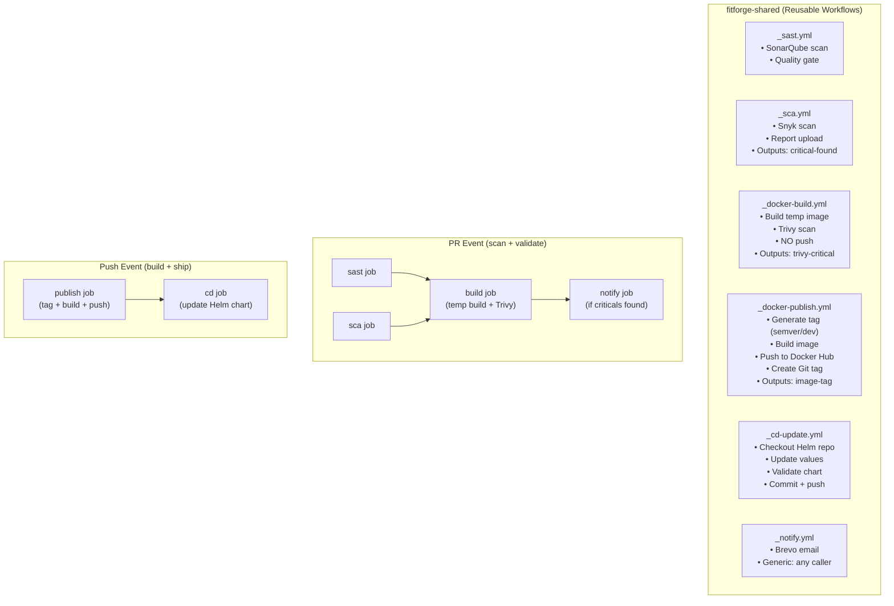
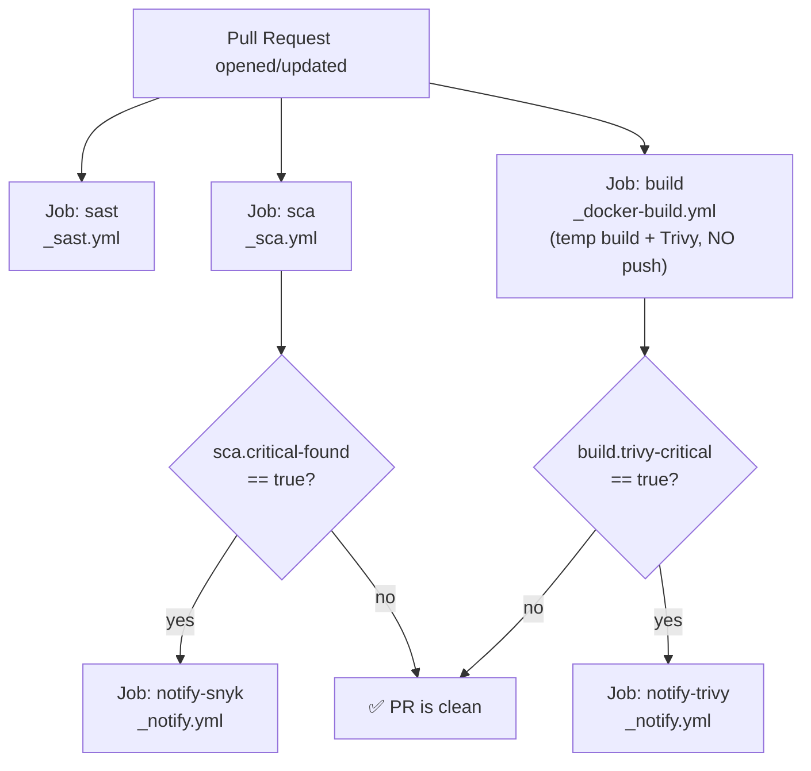
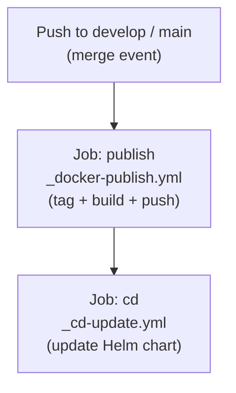
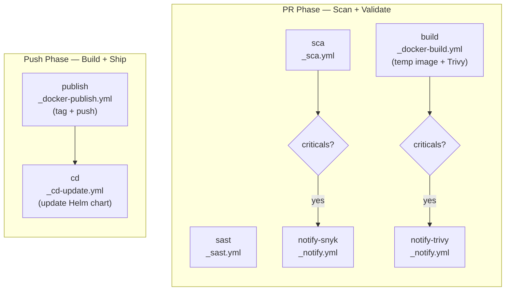

# FitForge CI/CD Workflow Strategy — Loosely Coupled Reusable Templates

> **Problem**: The current `_ci-template.yml` is a monolithic 250+ line file that does everything — scanning, building, pushing, notifying. It's tightly coupled and hard to maintain.  
> **Solution**: Break it into **small, focused, composable workflows** that each do ONE thing.

---

## Table of Contents

1. [What's Wrong with the Current Template](#1-whats-wrong-with-the-current-template)
2. [The New Architecture](#2-the-new-architecture)
3. [Workflow Design Principles](#3-workflow-design-principles)
4. [The Composition Pattern — PR vs Push](#4-the-composition-pattern--pr-vs-push)
5. [Template 1 — `_sast.yml` (SonarQube)](#5-template-1--_sastyml-sonarqube)
6. [Template 2 — `_sca.yml` (Snyk)](#6-template-2--_scayml-snyk)
7. [Template 3 — `_docker-build.yml` (Build + Trivy)](#7-template-3--_docker-buildyml-build--trivy)
8. [Template 4 — `_docker-publish.yml` (Tag + Push + CD)](#8-template-4--_docker-publishyml-tag--push--cd)
9. [Template 5 — `_cd-update.yml` (Update Helm Chart)](#9-template-5--_cd-updateyml-update-helm-chart)
10. [Template 6 — `_notify.yml` (Email Alerts)](#10-template-6--_notifyyml-email-alerts)
11. [How Service Repos Compose These Templates](#11-how-service-repos-compose-these-templates)
12. [Complete Service Workflow Examples](#12-complete-service-workflow-examples)
13. [Comparison: Old vs New](#13-comparison-old-vs-new)
14. [Migration Guide](#14-migration-guide)

---

## 1. What's Wrong with the Current Template

Let's break down the problems with your current `_ci-template.yml`:

### Problem 1: It Does Too Many Things

Your single template currently handles:
- ✅ SonarQube SAST scanning
- ✅ Sonar Quality Gate checking
- ✅ Snyk SCA scanning (with different logic for Node vs Python)
- ✅ Snyk report generation + upload
- ✅ Critical vulnerability checking
- ✅ Email alerts via Brevo
- ✅ Semantic versioning
- ✅ Git tag validation
- ✅ Docker login + build + push
- ✅ Trivy vulnerability scanning
- ✅ Trivy report alerts

That's **12 different responsibilities** in one file!

### Problem 2: Runtime Conditionals Everywhere

You have `if: inputs.runtime == 'node'` and `if: inputs.runtime == 'python'` scattered throughout:

```yaml
# This pattern repeats 6+ times in your current template
- name: Setup Node.js
  if: inputs.runtime == 'node'
  ...
- name: Setup Python
  if: inputs.runtime == 'python'
  ...
```

Every time you add a new runtime (e.g., Go, Rust), you add MORE conditionals everywhere.

### Problem 3: Scanning Happens on Both PR and Push

In the current setup, scans run on pushes too — wasting time and GitHub Actions minutes. If you already scanned in the PR, why scan again after merge?

### Problem 4: Notifications Are Embedded Inside Scan Templates

Email alert logic is buried inside the scanning and building steps. If you want to change your notification provider (Brevo → Slack → Discord), you'd have to edit multiple files.

### Problem 5: Can't Build-Only-Test the Docker Image on PRs

Currently, Docker images are either built+pushed or not built at all. There's no way to build temporarily just to run Trivy on a PR without pushing to Docker Hub.

---

## 2. The New Architecture

Break the monolith into **6 small, focused reusable workflows** with a **clear split between PR and Push**:



### The Key Insight: PR ≠ Push

| Event | Purpose | Jobs | Scanning? | Docker Push? | CD? |
|---|---|---|---|---|---|
| **Pull Request** | Validate everything before merge | SAST + SCA + Build (temp) + Trivy + Notify | ✅ Yes | ❌ No | ❌ No |
| **Push (merge)** | Ship the validated code | Publish + CD | ❌ No (already done in PR) | ✅ Yes | ✅ Yes |

### Sizing Comparison

| Template | Lines | Responsibility |
|---|---|---|
| `_sast.yml` | ~45 | SonarQube scanning |
| `_sca.yml` | ~75 | Snyk scanning (NO email) |
| `_docker-build.yml` | ~55 | Temp build + Trivy (NO push, NO email) |
| `_docker-publish.yml` | ~90 | Tag + build + push + git tag |
| `_cd-update.yml` | ~70 | Update Helm chart |
| `_notify.yml` | ~45 | Email alerts (ALL notifications go through here) |
| **Total** | **~380** | **6 files, each does ONE thing** |

---

## 3. Workflow Design Principles

### Principle 1: Single Responsibility

Each workflow does **one thing well**:
- `_sast.yml` → Static code analysis. That's it.
- `_sca.yml` → Dependency scanning. Outputs results. **Never sends emails.**
- `_docker-build.yml` → Temp build + Trivy. **Never pushes. Never sends emails.**
- `_docker-publish.yml` → Tag + build + push. That's it.
- `_cd-update.yml` → Update Helm chart. That's it.
- `_notify.yml` → Send emails. **The ONLY place that sends emails.**

### Principle 2: Scan Once, Ship Fast

- **PR phase**: Do ALL the heavy scanning (SonarQube, Snyk, Trivy). This is the safety gate.
- **Push phase**: The code was already validated in the PR. Just build, tag, push, and deploy. Fast.

### Principle 3: Outputs Enable Composition

Workflows pass results to the caller via `outputs`:
- `_sca.yml` outputs `critical-found` → caller decides whether to call `_notify.yml`
- `_docker-build.yml` outputs `trivy-critical` → caller decides whether to call `_notify.yml`
- `_docker-publish.yml` outputs `image-tag` → `_cd-update.yml` consumes it

### Principle 4: Notifications Are Centralized

Email logic lives in ONE place: `_notify.yml`. The scanning templates **never** send emails directly. They just output a boolean (`critical-found: true/false`), and the **caller** decides whether to call `_notify.yml`.

**Why?** If you switch from Brevo to Slack tomorrow, you change ONE file instead of three.

### Principle 5: Fail Fast, Fail Independently

If SonarQube is down, Snyk still runs. If Trivy finds criticals, the PR is flagged but not blocked (you decide the policy in the caller).

---

## 4. The Composition Pattern — PR vs Push

### PR Flow (Scan Everything, Push Nothing)



### Push Flow (Build + Ship, No Scanning)



**Result:**
- PRs are **thorough** (SAST + SCA + build + Trivy + notify) — your safety gate
- Pushes are **fast** (just build + push + CD) — no redundant scanning

---

## 5. Template 1 — `_sast.yml` (SonarQube)

**Purpose**: Run SonarQube SAST scanning and check the quality gate.  
**Used in**: PR flow only.  
**Outputs**: Quality gate status.

```yaml
# fitforge-shared/.github/workflows/_sast.yml
name: _SAST — SonarQube Scan

on:
  workflow_call:
    inputs:
      service-path:
        description: "Path to the service source code"
        required: false
        type: string
        default: "."
    secrets:
      SONAR_TOKEN:
        required: true
      SONAR_URL:
        required: true
    outputs:
      quality-gate:
        description: "Quality gate result (passed/failed)"
        value: ${{ jobs.sast.outputs.gate_status }}

jobs:
  sast:
    name: SonarQube Analysis
    runs-on: ubuntu-latest
    outputs:
      gate_status: ${{ steps.gate.outputs.status }}
    steps:
      - name: Checkout code
        uses: actions/checkout@v4
        with:
          fetch-depth: 0

      - name: Run SonarQube Scan
        uses: SonarSource/sonarqube-scan-action@v6
        with:
          projectBaseDir: ${{ inputs.service-path }}
        env:
          SONAR_TOKEN: ${{ secrets.SONAR_TOKEN }}
          SONAR_HOST_URL: ${{ secrets.SONAR_URL }}

      - name: SonarQube Quality Gate
        id: gate
        uses: SonarSource/sonarqube-quality-gate-action@v1
        with:
          scanMetadataReportFile: ${{ inputs.service-path }}/.scannerwork/report-task.txt
        timeout-minutes: 5
        env:
          SONAR_TOKEN: ${{ secrets.SONAR_TOKEN }}

      - name: Set Gate Output
        if: always()
        run: |
          echo "status=${{ steps.gate.outcome }}" >> $GITHUB_OUTPUT
```

---

## 6. Template 2 — `_sca.yml` (Snyk)

**Purpose**: Run Snyk dependency scanning, generate reports, check for criticals.  
**Used in**: PR flow only.  
**Outputs**: `critical-found` boolean — the **caller** decides what to do with it.  
**Does NOT send emails** — that's `_notify.yml`'s job.

```yaml
# fitforge-shared/.github/workflows/_sca.yml
name: _SCA — Snyk Dependency Scan

on:
  workflow_call:
    inputs:
      service-name:
        description: "Service name for artifact naming"
        required: true
        type: string
      service-path:
        description: "Path to the service source code"
        required: false
        type: string
        default: "."
      runtime:
        description: "Runtime: node or python"
        required: false
        type: string
        default: "node"
    secrets:
      SNYK_TOKEN:
        required: true
    outputs:
      critical-found:
        description: "Whether critical/high vulnerabilities were found (true/false)"
        value: ${{ jobs.sca.outputs.critical_found }}

jobs:
  sca:
    name: Snyk Scan
    runs-on: ubuntu-latest
    outputs:
      critical_found: ${{ steps.snyk-check.outputs.critical_found }}
    defaults:
      run:
        working-directory: ${{ inputs.service-path }}
    steps:
      - name: Checkout code
        uses: actions/checkout@v4

      # ─── Runtime Setup ───
      - name: Setup Node.js
        if: inputs.runtime == 'node'
        uses: actions/setup-node@v4
        with:
          node-version: "20"
          cache: "npm"
          cache-dependency-path: "${{ inputs.service-path }}/package-lock.json"

      - name: Install Node dependencies
        if: inputs.runtime == 'node'
        run: npm ci

      - name: Setup Python
        if: inputs.runtime == 'python'
        uses: actions/setup-python@v5
        with:
          python-version: "3.11"
          cache: "pip"

      - name: Install Python dependencies
        if: inputs.runtime == 'python'
        run: pip install -r requirements.txt

      # ─── Snyk Scan ───
      - name: Setup Snyk CLI
        uses: snyk/actions/setup@master

      - name: Install snyk-to-html
        run: npm install -g snyk-to-html

      - name: Snyk Test (Node)
        if: inputs.runtime == 'node'
        run: snyk test --severity-threshold=high --json-file-output=snyk-report.json || true
        env:
          SNYK_TOKEN: ${{ secrets.SNYK_TOKEN }}

      - name: Snyk Test (Python)
        if: inputs.runtime == 'python'
        run: snyk test --file=requirements.txt --package-manager=pip --severity-threshold=high --json-file-output=snyk-report.json || true
        env:
          SNYK_TOKEN: ${{ secrets.SNYK_TOKEN }}

      - name: Convert Snyk report to HTML
        run: snyk-to-html -i snyk-report.json -o snyk-report.html

      - name: Upload Snyk Report
        uses: actions/upload-artifact@v4
        if: always()
        with:
          name: snyk-report-${{ inputs.service-name }}
          path: ${{ inputs.service-path }}/snyk-report.html
          retention-days: 14

      # ─── Critical Check (output only, no email!) ───
      - name: Check for Critical Vulnerabilities
        id: snyk-check
        run: |
          CRITICAL_COUNT=$(jq '[.vulnerabilities[] | select(.severity == "critical" or .severity == "high")] | length' snyk-report.json 2>/dev/null || echo "0")
          echo "Critical/High count: $CRITICAL_COUNT"
          if [ "$CRITICAL_COUNT" -gt 0 ]; then
            echo "critical_found=true" >> $GITHUB_OUTPUT
          else
            echo "critical_found=false" >> $GITHUB_OUTPUT
          fi
```

> [!IMPORTANT]
> Notice: **NO email logic here.** The workflow just outputs `critical-found: true/false`. The caller decides whether to call `_notify.yml`. This keeps the template clean and reusable.

---

## 7. Template 3 — `_docker-build.yml` (Build + Trivy)

**Purpose**: Build a **temporary** Docker image (never pushed) and run Trivy vulnerability scan on it.  
**Used in**: PR flow only.  
**Outputs**: `trivy-critical` boolean — the **caller** decides whether to notify.  
**Does NOT push to Docker Hub.** Does NOT send emails.

```yaml
# fitforge-shared/.github/workflows/_docker-build.yml
name: _Docker Build — Temp Build + Trivy Scan

on:
  workflow_call:
    inputs:
      service-name:
        description: "Service name for image naming and reports"
        required: true
        type: string
      service-path:
        description: "Path to Dockerfile"
        required: false
        type: string
        default: "."
    outputs:
      trivy-critical:
        description: "Whether CRITICAL vulnerabilities were found in the image (true/false)"
        value: ${{ jobs.build-scan.outputs.trivy_critical }}

jobs:
  build-scan:
    name: Build & Scan Image
    runs-on: ubuntu-latest
    outputs:
      trivy_critical: ${{ steps.trivy_check.outputs.critical_found }}
    defaults:
      run:
        working-directory: ${{ inputs.service-path }}
    steps:
      - name: Checkout code
        uses: actions/checkout@v4

      # ─── Build Temp Image (local only, never pushed) ───
      - name: Build Docker Image (Temp)
        run: |
          docker build -t ${{ inputs.service-name }}:pr-test .
          echo "✅ Temp image built: ${{ inputs.service-name }}:pr-test"

      # ─── Trivy Scan ───
      - name: Trivy Vulnerability Scan
        uses: aquasecurity/trivy-action@master
        with:
          image-ref: "${{ inputs.service-name }}:pr-test"
          format: "table"
          output: "${{ github.workspace }}/trivy-report-${{ inputs.service-name }}.txt"
          scan-type: "image"
          severity: "CRITICAL,HIGH"
          exit-code: "0"
          ignore-unfixed: true
          vuln-type: "os,library"

      - name: Upload Trivy Report
        uses: actions/upload-artifact@v4
        if: always()
        with:
          name: trivy-${{ inputs.service-name }}
          path: "${{ github.workspace }}/trivy-report-${{ inputs.service-name }}.txt"
          retention-days: 14

      # ─── Critical Check (output only, no email!) ───
      - name: Check Trivy for Criticals
        id: trivy_check
        run: |
          if grep -qE "CRITICAL" "${{ github.workspace }}/trivy-report-${{ inputs.service-name }}.txt"; then
            echo "critical_found=true" >> $GITHUB_OUTPUT
            echo "⚠️ CRITICAL vulnerabilities found!"
          else
            echo "critical_found=false" >> $GITHUB_OUTPUT
            echo "✅ No critical vulnerabilities."
          fi
```

> [!NOTE]
> This template is **lean** — ~55 lines. It builds a throwaway image tagged `pr-test`, runs Trivy, outputs the result, and the image is discarded when the runner shuts down. No Docker Hub credentials needed!

---

## 8. Template 4 — `_docker-publish.yml` (Tag + Push + CD)

**Purpose**: Generate the version tag (semver for main, dev-SHA for develop), build the final Docker image, push to Docker Hub, and create a Git tag. This runs **only on push** (after merge).  
**No scanning** — that was already done in the PR.

```yaml
# fitforge-shared/.github/workflows/_docker-publish.yml
name: _Docker Publish — Tag, Build & Push

on:
  workflow_call:
    inputs:
      service-name:
        description: "Service name (used for image name and tag prefix)"
        required: true
        type: string
      service-path:
        description: "Path to Dockerfile"
        required: false
        type: string
        default: "."
      environment:
        description: "Environment branch (develop or main)"
        required: true
        type: string
    secrets:
      DOCKER_USERNAME:
        required: true
      DOCKER_PASSWORD:
        required: true
    outputs:
      image-tag:
        description: "The Docker image tag that was built and pushed"
        value: ${{ jobs.publish.outputs.tag }}
      image-full:
        description: "Full image reference (registry/name:tag)"
        value: ${{ jobs.publish.outputs.full_image }}

jobs:
  publish:
    name: Publish Image
    runs-on: ubuntu-latest
    outputs:
      tag: ${{ steps.tag.outputs.tag }}
      full_image: ${{ steps.tag.outputs.full_image }}
    defaults:
      run:
        working-directory: ${{ inputs.service-path }}
    steps:
      - name: Checkout code
        uses: actions/checkout@v4
        with:
          fetch-depth: 0

      # ─── Version Tagging ───
      - name: Calculate Semantic Version (Main Only)
        id: semver
        if: inputs.environment == 'main'
        uses: mathieudutour/github-tag-action@v6.2
        with:
          github_token: ${{ github.token }}
          tag_prefix: ${{ inputs.service-name }}-v
          dry_run: true
          default_bump: patch

      - name: Generate Tag
        id: tag
        run: |
          if [ "${{ inputs.environment }}" = "main" ]; then
            TAG="${{ steps.semver.outputs.new_tag }}"
          else
            TAG="dev-${GITHUB_SHA}"
          fi
          echo "tag=$TAG" >> $GITHUB_OUTPUT
          echo "full_image=${{ secrets.DOCKER_USERNAME }}/${{ inputs.service-name }}:$TAG" >> $GITHUB_OUTPUT
          echo "🏷️ Image tag: $TAG"

      # ─── Tag Validation ───
      - name: Validate Existing Git Tag
        id: tag_check
        run: |
          TAG=${{ steps.tag.outputs.tag }}
          git fetch --tags origin || true
          if git rev-parse "$TAG" >/dev/null 2>&1; then
            TAG_COMMIT=$(git rev-list -n 1 "$TAG")
            CURRENT_COMMIT=$(git rev-parse HEAD)
            if [ "$TAG_COMMIT" != "$CURRENT_COMMIT" ]; then
              echo "❌ Tag exists but points to different commit!"
              exit 1
            fi
            echo "exists=true" >> $GITHUB_OUTPUT
          else
            echo "exists=false" >> $GITHUB_OUTPUT
          fi

      # ─── Docker Login ───
      - name: Login to Docker Hub
        run: echo "${{ secrets.DOCKER_PASSWORD }}" | docker login -u "${{ secrets.DOCKER_USERNAME }}" --password-stdin

      # ─── Image Check (Skip if Already Exists) ───
      - name: Check if Image Already Exists
        id: image_check
        run: |
          if docker manifest inspect ${{ steps.tag.outputs.full_image }} > /dev/null 2>&1; then
            echo "exists=true" >> $GITHUB_OUTPUT
            echo "⏭️ Image already exists. Skipping build."
          else
            echo "exists=false" >> $GITHUB_OUTPUT
          fi

      # ─── Build ───
      - name: Build Docker Image
        id: docker_build
        if: steps.image_check.outputs.exists != 'true'
        run: |
          docker build -t ${{ steps.tag.outputs.full_image }} .
          echo "built=true" >> $GITHUB_OUTPUT

      # ─── Push Image ───
      - name: Push Docker Image
        if: steps.docker_build.outputs.built == 'true'
        run: |
          docker push ${{ steps.tag.outputs.full_image }}
          echo "✅ Pushed: ${{ steps.tag.outputs.full_image }}"

      # ─── Create Git Tag ───
      - name: Create Git Tag
        if: inputs.environment == 'main' && steps.tag_check.outputs.exists != 'true'
        run: |
          git config user.name "github-actions"
          git config user.email "actions@github.com"
          git tag ${{ steps.tag.outputs.tag }}
          git push origin ${{ steps.tag.outputs.tag }}
          echo "🏷️ Git tag created: ${{ steps.tag.outputs.tag }}"
```

> [!IMPORTANT]
> Notice: **No Trivy scan here.** The image was already scanned during the PR phase. This workflow is focused purely on publishing — it's fast.

---

## 9. Template 5 — `_cd-update.yml` (Update Helm Chart)

**Purpose**: Take an image tag, update the correct `values-dev.yaml` or `values-prod.yaml` in the Helm repo, validate the chart, commit and push.  
**Used in**: Push flow only (after `_docker-publish.yml`).

```yaml
# fitforge-shared/.github/workflows/_cd-update.yml
name: _CD — Update Helm Chart

on:
  workflow_call:
    inputs:
      service-name:
        description: "Service name (matches Helm chart directory name)"
        required: true
        type: string
      image-tag:
        description: "Docker image tag to deploy"
        required: true
        type: string
      environment:
        description: "Environment branch: develop or main"
        required: true
        type: string
      helm-repo:
        description: "The GitOps Helm charts repository"
        required: false
        type: string
        default: "fitforge101/fitforge-helm-charts"
    secrets:
      HELM_REPO_PAT:
        required: true

jobs:
  update-chart:
    name: Update Helm Chart
    runs-on: ubuntu-latest
    steps:
      # ─── Determine Target Branch & Values File ───
      - name: Set Environment Config
        id: config
        run: |
          if [ "${{ inputs.environment }}" == "main" ]; then
            echo "branch=main" >> $GITHUB_OUTPUT
            echo "values_file=charts/${{ inputs.service-name }}/values-prod.yaml" >> $GITHUB_OUTPUT
            echo "env_name=prod" >> $GITHUB_OUTPUT
          else
            echo "branch=develop" >> $GITHUB_OUTPUT
            echo "values_file=charts/${{ inputs.service-name }}/values-dev.yaml" >> $GITHUB_OUTPUT
            echo "env_name=dev" >> $GITHUB_OUTPUT
          fi

      # ─── Checkout Helm Repo ───
      - name: Checkout Helm Charts Repo
        uses: actions/checkout@v4
        with:
          repository: ${{ inputs.helm-repo }}
          token: ${{ secrets.HELM_REPO_PAT }}
          ref: ${{ steps.config.outputs.branch }}

      # ─── Update Image Tag ───
      - name: Install yq
        run: |
          sudo wget -qO /usr/local/bin/yq https://github.com/mikefarah/yq/releases/latest/download/yq_linux_amd64
          sudo chmod +x /usr/local/bin/yq

      - name: Update Image Tag
        run: |
          VALUES_FILE="${{ steps.config.outputs.values_file }}"
          echo "📦 Service:     ${{ inputs.service-name }}"
          echo "🌍 Environment: ${{ steps.config.outputs.env_name }}"
          echo "🏷️  New tag:     ${{ inputs.image-tag }}"

          yq eval '.image.tag = "${{ inputs.image-tag }}"' -i "$VALUES_FILE"

          echo "✅ Updated:"
          cat "$VALUES_FILE"

      # ─── Validate Before Committing ───
      - name: Install Helm
        uses: azure/setup-helm@v4

      - name: Validate Chart
        run: |
          helm lint charts/${{ inputs.service-name }}/ \
            -f charts/${{ inputs.service-name }}/values.yaml \
            -f ${{ steps.config.outputs.values_file }}

          helm template ${{ inputs.service-name }} charts/${{ inputs.service-name }}/ \
            -f charts/${{ inputs.service-name }}/values.yaml \
            -f ${{ steps.config.outputs.values_file }} > /dev/null

          echo "✅ Helm chart validated!"

      # ─── Commit & Push ───
      - name: Commit and Push
        run: |
          git config user.name "github-actions[bot]"
          git config user.email "github-actions[bot]@users.noreply.github.com"
          git add .

          if git diff --cached --quiet; then
            echo "⏭️ No changes. Skipping."
          else
            git commit -m "🚀 deploy(${{ inputs.service-name }}): ${{ inputs.image-tag }} [${{ steps.config.outputs.env_name }}]

          Source: ${{ github.repository }}@${{ github.sha }}
          Run: ${{ github.server_url }}/${{ github.repository }}/actions/runs/${{ github.run_id }}"
            git push
            echo "✅ Pushed to ${{ steps.config.outputs.branch }}!"
          fi
```

---

## 10. Template 6 — `_notify.yml` (Email Alerts)

**Purpose**: The **single source of truth** for all email notifications. Every other template outputs results — this one acts on them.  
**Used in**: PR flow (called by the composer when criticals are found).

```yaml
# fitforge-shared/.github/workflows/_notify.yml
name: _Notify — Email Alert (Brevo)

on:
  workflow_call:
    inputs:
      subject:
        description: "Email subject line"
        required: true
        type: string
      body:
        description: "Email body text"
        required: true
        type: string
      service-name:
        description: "Service name for context"
        required: false
        type: string
        default: ""
      artifact-name:
        description: "Name of the artifact to download and attach (optional)"
        required: false
        type: string
        default: ""
    secrets:
      BREVO_API_KEY:
        required: true

jobs:
  send-email:
    name: Send Email Alert
    runs-on: ubuntu-latest
    steps:
      # ─── Download Report Artifact (if provided) ───
      - name: Download Report Artifact
        if: inputs.artifact-name != ''
        uses: actions/download-artifact@v4
        with:
          name: ${{ inputs.artifact-name }}
          path: ./report

      # ─── Send Email Without Attachment ───
      - name: Send Email (No Attachment)
        if: inputs.artifact-name == ''
        run: |
          curl --request POST \
            --url https://api.brevo.com/v3/smtp/email \
            --header "accept: application/json" \
            --header "api-key: $BREVO_API_KEY" \
            --header "content-type: application/json" \
            --data "{
              \"sender\": {\"name\": \"CI/CD Pipeline\", \"email\": \"fitforge360.in@gmail.com\"},
              \"to\": [{\"email\": \"fitforge360.in@gmail.com\"}],
              \"subject\": \"${{ inputs.subject }}\",
              \"textContent\": \"${{ inputs.body }}\n\nService: ${{ inputs.service-name }}\nRepo: ${{ github.repository }}\nRun: ${{ github.server_url }}/${{ github.repository }}/actions/runs/${{ github.run_id }}\"
            }"
        env:
          BREVO_API_KEY: ${{ secrets.BREVO_API_KEY }}

      # ─── Send Email With Attachment ───
      - name: Send Email (With Attachment)
        if: inputs.artifact-name != ''
        run: |
          # Find the report file (could be .html or .txt)
          REPORT_FILE=$(find ./report -type f | head -1)
          REPORT_NAME=$(basename "$REPORT_FILE")
          REPORT_BASE64=$(base64 -w 0 "$REPORT_FILE")

          cat > /tmp/brevo-payload.json << PAYLOAD_EOF
          {
            "sender": {"name": "CI/CD Pipeline", "email": "fitforge360.in@gmail.com"},
            "to": [{"email": "fitforge360.in@gmail.com"}],
            "subject": "${{ inputs.subject }}",
            "textContent": "${{ inputs.body }}\n\nService: ${{ inputs.service-name }}\nRepo: ${{ github.repository }}\nRun: ${{ github.server_url }}/${{ github.repository }}/actions/runs/${{ github.run_id }}",
            "attachment": [{"name": "$REPORT_NAME", "content": "$REPORT_BASE64"}]
          }
          PAYLOAD_EOF

          curl --request POST \
            --url https://api.brevo.com/v3/smtp/email \
            --header "accept: application/json" \
            --header "api-key: $BREVO_API_KEY" \
            --header "content-type: application/json" \
            --data @/tmp/brevo-payload.json
        env:
          BREVO_API_KEY: ${{ secrets.BREVO_API_KEY }}
```

> [!TIP]
> This template can **download artifacts** uploaded by `_sca.yml` or `_docker-build.yml` and attach them to the email. Pass the artifact name (e.g., `snyk-report-ai-service` or `trivy-ai-service`) and it handles everything.

---

## 11. How Service Repos Compose These Templates

Each service repo has **ONE workflow file** that composes all templates. The flow is split cleanly between PR and Push:



---

## 12. Complete Service Workflow Examples

### Example A: Python Service (AI Service)

```yaml
# fitforge-ai-service/.github/workflows/ci-cd.yml
name: CI/CD — AI Service

on:
  push:
    branches: [develop, main]
  pull_request:
    branches: [develop, main]

permissions:
  contents: write

jobs:
  # ╔══════════════════════════════════════════════╗
  # ║         PR PHASE — Scan + Validate           ║
  # ╚══════════════════════════════════════════════╝

  # ─── SAST (SonarQube) ───
  sast:
    if: github.event_name == 'pull_request'
    uses: fitforge101/fitforge-shared/.github/workflows/_sast.yml@main
    with:
      service-path: .
    secrets:
      SONAR_TOKEN: ${{ secrets.SONAR_TOKEN }}
      SONAR_URL: ${{ secrets.SONAR_URL }}

  # ─── SCA (Snyk) ───
  sca:
    if: github.event_name == 'pull_request'
    uses: fitforge101/fitforge-shared/.github/workflows/_sca.yml@main
    with:
      service-name: ai-service
      service-path: .
      runtime: python
    secrets:
      SNYK_TOKEN: ${{ secrets.SNYK_TOKEN }}

  # ─── Temp Docker Build + Trivy ───
  build:
    if: github.event_name == 'pull_request'
    uses: fitforge101/fitforge-shared/.github/workflows/_docker-build.yml@main
    with:
      service-name: ai-service
      service-path: .

  # ─── Notify: Snyk Criticals ───
  notify-snyk:
    needs: [sca]
    if: needs.sca.outputs.critical-found == 'true'
    uses: fitforge101/fitforge-shared/.github/workflows/_notify.yml@main
    with:
      subject: "🚨 Snyk: Critical Vulnerabilities in ai-service"
      body: "Critical/High vulnerabilities found in ai-service dependencies."
      service-name: ai-service
      artifact-name: snyk-report-ai-service
    secrets:
      BREVO_API_KEY: ${{ secrets.BREVO_API_KEY }}

  # ─── Notify: Trivy Criticals ───
  notify-trivy:
    needs: [build]
    if: needs.build.outputs.trivy-critical == 'true'
    uses: fitforge101/fitforge-shared/.github/workflows/_notify.yml@main
    with:
      subject: "🚨 Trivy: Critical Vulnerabilities in ai-service"
      body: "CRITICAL vulnerabilities found in ai-service Docker image."
      service-name: ai-service
      artifact-name: trivy-ai-service
    secrets:
      BREVO_API_KEY: ${{ secrets.BREVO_API_KEY }}

  # ╔══════════════════════════════════════════════╗
  # ║         PUSH PHASE — Build + Ship            ║
  # ╚══════════════════════════════════════════════╝

  # ─── Publish Docker Image ───
  publish:
    if: github.event_name == 'push'
    uses: fitforge101/fitforge-shared/.github/workflows/_docker-publish.yml@main
    with:
      service-name: ai-service
      service-path: .
      environment: ${{ github.ref_name }}
    secrets:
      DOCKER_USERNAME: ${{ secrets.DOCKER_USERNAME }}
      DOCKER_PASSWORD: ${{ secrets.DOCKER_PASSWORD }}

  # ─── Update Helm Chart (CD) ───
  cd:
    needs: [publish]
    if: needs.publish.result == 'success'
    uses: fitforge101/fitforge-shared/.github/workflows/_cd-update.yml@main
    with:
      service-name: ai-service
      image-tag: ${{ needs.publish.outputs.image-tag }}
      environment: ${{ github.ref_name }}
    secrets:
      HELM_REPO_PAT: ${{ secrets.HELM_REPO_PAT }}
```

### Example B: Node.js Service (User Service)

```yaml
# fitforge-user-service/.github/workflows/ci-cd.yml
name: CI/CD — User Service

on:
  push:
    branches: [develop, main]
  pull_request:
    branches: [develop, main]

permissions:
  contents: write

jobs:
  # ── PR Phase ──
  sast:
    if: github.event_name == 'pull_request'
    uses: fitforge101/fitforge-shared/.github/workflows/_sast.yml@main
    with:
      service-path: .
    secrets:
      SONAR_TOKEN: ${{ secrets.SONAR_TOKEN }}
      SONAR_URL: ${{ secrets.SONAR_URL }}

  sca:
    if: github.event_name == 'pull_request'
    uses: fitforge101/fitforge-shared/.github/workflows/_sca.yml@main
    with:
      service-name: user-service
      service-path: .
      runtime: node                            # ← Only difference from Python!
    secrets:
      SNYK_TOKEN: ${{ secrets.SNYK_TOKEN }}

  build:
    if: github.event_name == 'pull_request'
    uses: fitforge101/fitforge-shared/.github/workflows/_docker-build.yml@main
    with:
      service-name: user-service
      service-path: .

  notify-snyk:
    needs: [sca]
    if: needs.sca.outputs.critical-found == 'true'
    uses: fitforge101/fitforge-shared/.github/workflows/_notify.yml@main
    with:
      subject: "🚨 Snyk: Critical Vulnerabilities in user-service"
      body: "Critical/High vulnerabilities found in user-service dependencies."
      service-name: user-service
      artifact-name: snyk-report-user-service
    secrets:
      BREVO_API_KEY: ${{ secrets.BREVO_API_KEY }}

  notify-trivy:
    needs: [build]
    if: needs.build.outputs.trivy-critical == 'true'
    uses: fitforge101/fitforge-shared/.github/workflows/_notify.yml@main
    with:
      subject: "🚨 Trivy: Critical Vulnerabilities in user-service"
      body: "CRITICAL vulnerabilities found in user-service Docker image."
      service-name: user-service
      artifact-name: trivy-user-service
    secrets:
      BREVO_API_KEY: ${{ secrets.BREVO_API_KEY }}

  # ── Push Phase ──
  publish:
    if: github.event_name == 'push'
    uses: fitforge101/fitforge-shared/.github/workflows/_docker-publish.yml@main
    with:
      service-name: user-service
      service-path: .
      environment: ${{ github.ref_name }}
    secrets:
      DOCKER_USERNAME: ${{ secrets.DOCKER_USERNAME }}
      DOCKER_PASSWORD: ${{ secrets.DOCKER_PASSWORD }}

  cd:
    needs: [publish]
    if: needs.publish.result == 'success'
    uses: fitforge101/fitforge-shared/.github/workflows/_cd-update.yml@main
    with:
      service-name: user-service
      image-tag: ${{ needs.publish.outputs.image-tag }}
      environment: ${{ github.ref_name }}
    secrets:
      HELM_REPO_PAT: ${{ secrets.HELM_REPO_PAT }}
```

> [!TIP]
> The service workflows for Node.js and Python are **almost identical**. Only `runtime: node` vs `runtime: python` and the `service-name` differ.

---

## 13. Comparison: Old vs New

### Architecture

| Aspect | Old (Monolithic) | New (Modular) |
|---|---|---|
| **Files in shared repo** | 1 massive file | 6 small files |
| **Scanning on push** | ✅ Redundant (scans twice) | ❌ Skip (already done in PR) |
| **Docker build on PR** | ❌ No Trivy on PRs | ✅ Temp build + Trivy scan |
| **Notifications** | Embedded in 2 templates | Centralized in `_notify.yml` |
| **Push speed** | Slow (scans again) | Fast (just build + push + CD) |
| **Adding Slack** | Edit 3 files | Edit 1 file (`_notify.yml`) |
| **Debugging** | Scroll 250 lines | Open the ~50-line file that failed |

### Data Flow

```
PR EVENT:
  _sast.yml    → outputs: quality-gate
  _sca.yml     → outputs: critical-found → _notify.yml (if critical)
  _docker-build.yml → outputs: trivy-critical → _notify.yml (if critical)

PUSH EVENT (after merge):
  _docker-publish.yml → outputs: image-tag, image-full
  _cd-update.yml      (consumes image-tag from publish)
```

### GitHub Actions Minutes Saved

| Scenario | Old | New | Savings |
|---|---|---|---|
| PR created | ~8 min (SAST + SCA) | ~10 min (SAST + SCA + Trivy) | -2 min (more thorough!) |
| PR merged (push) | ~8 min (SAST + SCA + Build + Push) | ~3 min (Build + Push + CD only) | **5 min saved** |
| **Total per feature** | **~16 min** | **~13 min** | **~20% faster** |

The push phase is **much faster** because you skip all scanning.

---

## 14. Migration Guide

### Step 1: Create the New Templates

In `fitforge-shared`, create all 6 new workflow files alongside the existing `_ci-template.yml`:

```
fitforge-shared/.github/workflows/
├── _ci-template.yml          ← OLD (keep for now during migration)
├── _sast.yml                 ← NEW
├── _sca.yml                  ← NEW
├── _docker-build.yml         ← NEW (temp build + Trivy, NO push)
├── _docker-publish.yml       ← NEW (tag + build + push)
├── _cd-update.yml            ← NEW
└── _notify.yml               ← NEW
```

### Step 2: Migrate One Service at a Time

Start with `fitforge-ai-service`:

1. Create the new `ci-cd.yml` in the service repo
2. Rename the old `ci-ai-service.yml` to `ci-ai-service.yml.bak`
3. Open a PR to `develop` — this tests the PR flow!
4. Merge the PR — this tests the Push flow!
5. If both work, delete the `.bak` file
6. Repeat for the next service

### Step 3: Delete the Old Template

Once ALL services are migrated, delete `_ci-template.yml` from `fitforge-shared`.

---

## Quick Reference: All Workflow Files

| File | Location | Trigger | Purpose |
|---|---|---|---|
| `_sast.yml` | `fitforge-shared` | PR only | SonarQube scan |
| `_sca.yml` | `fitforge-shared` | PR only | Snyk scan (outputs: `critical-found`) |
| `_docker-build.yml` | `fitforge-shared` | PR only | Temp build + Trivy (outputs: `trivy-critical`) |
| `_docker-publish.yml` | `fitforge-shared` | Push only | Tag + build + push (outputs: `image-tag`) |
| `_cd-update.yml` | `fitforge-shared` | Push only | Update Helm chart |
| `_notify.yml` | `fitforge-shared` | Conditional | Email alert (called when criticals found) |
| `ci-cd.yml` | Each service repo | PR + Push | Composer that calls the above |

## Quick Reference: Workflow Outputs

| Workflow | Output Name | Type | Consumed By |
|---|---|---|---|
| `_sast.yml` | `quality-gate` | `success` / `failure` | Caller's `if` condition |
| `_sca.yml` | `critical-found` | `true` / `false` | Caller → `_notify.yml` |
| `_docker-build.yml` | `trivy-critical` | `true` / `false` | Caller → `_notify.yml` |
| `_docker-publish.yml` | `image-tag` | e.g., `dev-abc1234` | `_cd-update.yml` |
| `_docker-publish.yml` | `image-full` | e.g., `aswindevs/ai-service:dev-abc1234` | Any consumer |
