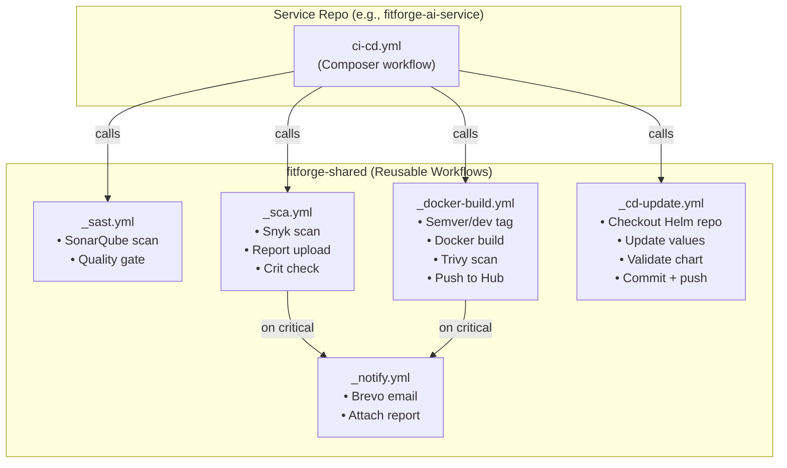
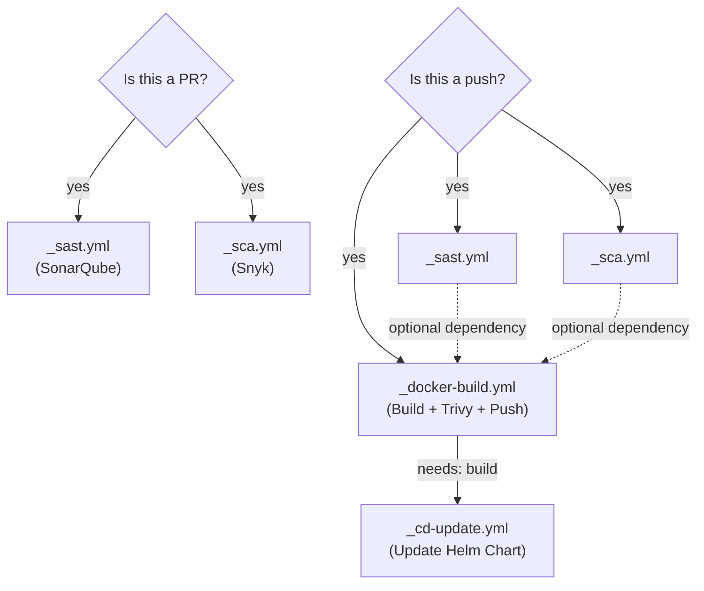
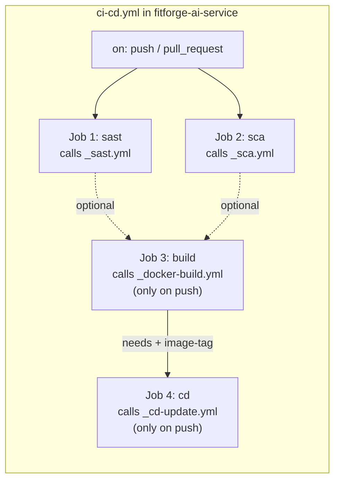

# FitForge CI/CD Workflow Strategy — Loosely Coupled Reusable Templates

> **Problem**: The current `_ci-template.yml` is a monolithic 250+ line file that does everything — scanning, building, pushing, notifying. It's tightly coupled and hard to maintain.  
> **Solution**: Break it into **small, focused, composable workflows** that each do ONE thing.

---

## Table of Contents

1. [What's Wrong with the Current Template](#1-whats-wrong-with-the-current-template)
2. [The New Architecture](#2-the-new-architecture)
3. [Workflow Design Principles](#3-workflow-design-principles)
4. [The Composition Pattern](#4-the-composition-pattern)
5. [Template 1 — `_sast.yml` (SonarQube)](#5-template-1--_sastyml-sonarqube)
6. [Template 2 — `_sca.yml` (Snyk)](#6-template-2--_scayml-snyk)
7. [Template 3 — `_docker-build.yml` (Build + Trivy + Push)](#7-template-3--_docker-buildyml-build--trivy--push)
8. [Template 4 — `_cd-update.yml` (Update Helm Chart)](#8-template-4--_cd-updateyml-update-helm-chart)
9. [Template 5 — `_notify.yml` (Email Alerts)](#9-template-5--_notifyyml-email-alerts)
10. [How Service Repos Compose These Templates](#10-how-service-repos-compose-these-templates)
11. [Complete Service Workflow Examples](#11-complete-service-workflow-examples)
12. [Comparison: Old vs New](#12-comparison-old-vs-new)
13. [Migration Guide](#13-migration-guide)

---

## 1. What's Wrong with the Current Template

Let's break down the problems with your current `_ci-template.yml`:

### Problem 1: It Does Too Many Things

Your single template currently handles:
- ✅ SonarQube SAST scanning
- ✅ Sonar Quality Gate checking
- ✅ Snyk SCA scanning (with different logic for Node vs Python)
- ✅ Snyk report generation + upload
- ✅ Critical vulnerability checking
- ✅ Email alerts via Brevo
- ✅ Semantic versioning
- ✅ Git tag validation
- ✅ Docker login + build + push
- ✅ Trivy vulnerability scanning
- ✅ Trivy report alerts

That's **12 different responsibilities** in one file!

### Problem 2: Runtime Conditionals Everywhere

You have `if: inputs.runtime == 'node'` and `if: inputs.runtime == 'python'` scattered throughout:

```yaml
# This pattern repeats 6+ times in your current template
- name: Setup Node.js
  if: inputs.runtime == 'node'
  ...
- name: Setup Python
  if: inputs.runtime == 'python'
  ...
- name: Install Node dependencies
  if: inputs.runtime == 'node'
  ...
- name: Install Python dependencies
  if: inputs.runtime == 'python'
  ...
```

Every time you add a new runtime (e.g., Go, Rust), you add MORE conditionals everywhere.

### Problem 3: Can't Use Pieces Independently

What if you want to:
- Run **only** SonarQube on a PR, without building Docker images? You can't.
- Run **only** Snyk scanning as a scheduled job? You can't.
- Skip Docker push but still run security scans? Complicated.

### Problem 4: Hard to Debug

When the workflow fails, you're looking at a 250-line file with 2 jobs and 25+ steps. Finding the issue is painful.

### Problem 5: Adding CD Breaks Everything

To add the CD step (updating Helm charts), you'd need to add ANOTHER job with MORE inputs to this already massive file.

---

## 2. The New Architecture

Break the monolith into **5 small, focused reusable workflows**:



### Sizing Comparison

| Template | Lines (Old) | Lines (New) |
|---|---|---|
| `_ci-template.yml` (monolith) | ~250 | ❌ Deleted |
| `_sast.yml` | — | ~45 |
| `_sca.yml` | — | ~80 |
| `_docker-build.yml` | — | ~100 |
| `_cd-update.yml` | — | ~70 |
| `_notify.yml` | — | ~35 |
| **Total** | **~250 in 1 file** | **~330 across 5 files** |

Yes, the total line count is slightly more. But each file is **small, focused, and testable independently**.

---

## 3. Workflow Design Principles

### Principle 1: Single Responsibility

Each workflow does **one thing well**:
- `_sast.yml` → Static code analysis. That's it.
- `_sca.yml` → Dependency vulnerability scanning. That's it.
- `_docker-build.yml` → Build, scan, push Docker images. That's it.

### Principle 2: Inputs Are Minimal

Each workflow only asks for what **it** needs. The Docker workflow doesn't need `SONAR_TOKEN`. The SAST workflow doesn't need `DOCKER_USERNAME`.

### Principle 3: Outputs Enable Composition

Workflows pass data to the next workflow via `outputs`:
- `_docker-build.yml` outputs `image-tag` → `_cd-update.yml` consumes it
- `_sca.yml` outputs `critical-found` → caller decides whether to notify

### Principle 4: Runtime Is the Caller's Problem

Instead of having runtime conditionals inside every template, only `_sca.yml` needs to know about runtime (because Snyk needs the dependencies installed). The other templates don't care if you're running Node, Python, or Go.

### Principle 5: Fail Fast, Fail Independently

If SonarQube is down, Docker builds still work. If Snyk has an issue, it doesn't block your deployment. You control the dependency chain in the **caller**, not the template.

---

## 4. The Composition Pattern

Each service repo has a **composer workflow** that calls the templates in order:



Key decisions made in the **caller**:
- **On PRs**: Run SAST + SCA only (no Docker build, no deploy)
- **On Push**: Run everything (SAST + SCA + Build + CD)
- **Dependencies**: You choose which jobs block which

---

## 5. Template 1 — `_sast.yml` (SonarQube)

**Purpose**: Run SonarQube SAST scanning and check the quality gate.  
**Inputs**: Just the service path and secrets.  
**Outputs**: Quality gate status.

```yaml
# fitforge-shared/.github/workflows/_sast.yml
name: _SAST — SonarQube Scan

on:
  workflow_call:
    inputs:
      service-path:
        description: "Path to the service source code"
        required: false
        type: string
        default: "."
    secrets:
      SONAR_TOKEN:
        required: true
      SONAR_URL:
        required: true
    outputs:
      quality-gate:
        description: "Quality gate result (passed/failed)"
        value: ${{ jobs.sast.outputs.gate_status }}

jobs:
  sast:
    name: SonarQube Analysis
    runs-on: ubuntu-latest
    outputs:
      gate_status: ${{ steps.gate.outputs.status }}
    steps:
      - name: Checkout code
        uses: actions/checkout@v4
        with:
          fetch-depth: 0

      - name: Run SonarQube Scan
        uses: SonarSource/sonarqube-scan-action@v6
        with:
          projectBaseDir: ${{ inputs.service-path }}
        env:
          SONAR_TOKEN: ${{ secrets.SONAR_TOKEN }}
          SONAR_HOST_URL: ${{ secrets.SONAR_URL }}

      - name: SonarQube Quality Gate
        id: gate
        uses: SonarSource/sonarqube-quality-gate-action@v1
        with:
          scanMetadataReportFile: ${{ inputs.service-path }}/.scannerwork/report-task.txt
        timeout-minutes: 5
        env:
          SONAR_TOKEN: ${{ secrets.SONAR_TOKEN }}

      - name: Set Gate Output
        if: always()
        run: |
          echo "status=${{ steps.gate.outcome }}" >> $GITHUB_OUTPUT
```

**That's it.** 45 lines. Does one thing. Clean.

---

## 6. Template 2 — `_sca.yml` (Snyk)

**Purpose**: Run Snyk dependency vulnerability scanning, generate reports, check for criticals.  
**Key detail**: This is the **only** template that needs to know about runtime (Node vs Python), because Snyk needs dependencies installed to scan them.

```yaml
# fitforge-shared/.github/workflows/_sca.yml
name: _SCA — Snyk Dependency Scan

on:
  workflow_call:
    inputs:
      service-name:
        description: "Service name for artifact naming"
        required: true
        type: string
      service-path:
        description: "Path to the service source code"
        required: false
        type: string
        default: "."
      runtime:
        description: "Runtime: node or python"
        required: false
        type: string
        default: "node"
    secrets:
      SNYK_TOKEN:
        required: true
      BREVO_API_KEY:
        required: false
    outputs:
      critical-found:
        description: "Whether critical/high vulnerabilities were found"
        value: ${{ jobs.sca.outputs.critical_found }}

jobs:
  sca:
    name: Snyk Scan
    runs-on: ubuntu-latest
    outputs:
      critical_found: ${{ steps.snyk-check.outputs.critical_found }}
    defaults:
      run:
        working-directory: ${{ inputs.service-path }}
    steps:
      - name: Checkout code
        uses: actions/checkout@v4

      # ─── Runtime Setup (Node or Python) ───
      - name: Setup Node.js
        if: inputs.runtime == 'node'
        uses: actions/setup-node@v4
        with:
          node-version: "20"
          cache: "npm"
          cache-dependency-path: "${{ inputs.service-path }}/package-lock.json"

      - name: Install Node dependencies
        if: inputs.runtime == 'node'
        run: npm ci

      - name: Setup Python
        if: inputs.runtime == 'python'
        uses: actions/setup-python@v5
        with:
          python-version: "3.11"
          cache: "pip"

      - name: Install Python dependencies
        if: inputs.runtime == 'python'
        run: pip install -r requirements.txt

      # ─── Snyk Scan ───
      - name: Setup Snyk CLI
        uses: snyk/actions/setup@master

      - name: Install snyk-to-html
        run: npm install -g snyk-to-html

      - name: Snyk Test (Node)
        if: inputs.runtime == 'node'
        run: snyk test --severity-threshold=high --json-file-output=snyk-report.json || true
        env:
          SNYK_TOKEN: ${{ secrets.SNYK_TOKEN }}

      - name: Snyk Test (Python)
        if: inputs.runtime == 'python'
        run: snyk test --file=requirements.txt --package-manager=pip --severity-threshold=high --json-file-output=snyk-report.json || true
        env:
          SNYK_TOKEN: ${{ secrets.SNYK_TOKEN }}

      - name: Convert Snyk report to HTML
        run: snyk-to-html -i snyk-report.json -o snyk-report.html

      - name: Upload Snyk Report
        uses: actions/upload-artifact@v4
        if: always()
        with:
          name: snyk-report-${{ inputs.service-name }}
          path: ${{ inputs.service-path }}/snyk-report.html
          retention-days: 14

      # ─── Critical Check ───
      - name: Check for Critical Vulnerabilities
        id: snyk-check
        run: |
          CRITICAL_COUNT=$(jq '[.vulnerabilities[] | select(.severity == "critical" or .severity == "high")] | length' snyk-report.json 2>/dev/null || echo "0")
          echo "Critical/High count: $CRITICAL_COUNT"
          if [ "$CRITICAL_COUNT" -gt 0 ]; then
            echo "critical_found=true" >> $GITHUB_OUTPUT
          else
            echo "critical_found=false" >> $GITHUB_OUTPUT
          fi

      # ─── Alert (only if Brevo key is provided) ───
      - name: Send Snyk Alert Email (Brevo)
        if: steps.snyk-check.outputs.critical_found == 'true' && secrets.BREVO_API_KEY != ''
        run: |
          REPORT_BASE64=$(base64 -w 0 snyk-report.html)
          curl --request POST \
            --url https://api.brevo.com/v3/smtp/email \
            --header "accept: application/json" \
            --header "api-key: $BREVO_API_KEY" \
            --header "content-type: application/json" \
            --data "{
              \"sender\": {\"name\": \"CI Pipeline\", \"email\": \"fitforge360.in@gmail.com\"},
              \"to\": [{\"email\": \"fitforge360.in@gmail.com\"}],
              \"subject\": \"🚨 Snyk: Critical Vulnerabilities in ${{ inputs.service-name }}\",
              \"textContent\": \"Critical vulnerabilities found in ${{ inputs.service-name }}. See attached Snyk report.\",
              \"attachment\": [{\"name\": \"snyk-report.html\", \"content\": \"$REPORT_BASE64\"}]
            }"
        env:
          BREVO_API_KEY: ${{ secrets.BREVO_API_KEY }}
```

---

## 7. Template 3 — `_docker-build.yml` (Build + Trivy + Push)

**Purpose**: Calculate version tag, build Docker image, run Trivy scan, push to Docker Hub, create Git tag.  
**Key change**: This template doesn't know or care about SonarQube or Snyk. It just builds.

```yaml
# fitforge-shared/.github/workflows/_docker-build.yml
name: _Docker Build — Build, Scan & Push

on:
  workflow_call:
    inputs:
      service-name:
        description: "Service name (used for image name and tag prefix)"
        required: true
        type: string
      service-path:
        description: "Path to Dockerfile"
        required: false
        type: string
        default: "."
      environment:
        description: "Environment branch (develop or main)"
        required: true
        type: string
    secrets:
      DOCKER_USERNAME:
        required: true
      DOCKER_PASSWORD:
        required: true
      BREVO_API_KEY:
        required: false
    outputs:
      image-tag:
        description: "The Docker image tag that was built and pushed"
        value: ${{ jobs.build.outputs.tag }}
      image-full:
        description: "Full image reference (registry/name:tag)"
        value: ${{ jobs.build.outputs.full_image }}

jobs:
  build:
    name: Build & Push
    runs-on: ubuntu-latest
    outputs:
      tag: ${{ steps.tag.outputs.tag }}
      full_image: ${{ steps.tag.outputs.full_image }}
    defaults:
      run:
        working-directory: ${{ inputs.service-path }}
    steps:
      - name: Checkout code
        uses: actions/checkout@v4
        with:
          fetch-depth: 0

      # ─── Version Tagging ───
      - name: Calculate Semantic Version (Main Only)
        id: semver
        if: inputs.environment == 'main'
        uses: mathieudutour/github-tag-action@v6.2
        with:
          github_token: ${{ github.token }}
          tag_prefix: ${{ inputs.service-name }}-v
          dry_run: true
          default_bump: patch

      - name: Generate Tag
        id: tag
        run: |
          if [ "${{ inputs.environment }}" = "main" ]; then
            TAG="${{ steps.semver.outputs.new_tag }}"
          else
            TAG="dev-${GITHUB_SHA}"
          fi
          echo "tag=$TAG" >> $GITHUB_OUTPUT
          echo "full_image=${{ secrets.DOCKER_USERNAME }}/${{ inputs.service-name }}:$TAG" >> $GITHUB_OUTPUT
          echo "🏷️ Image tag: $TAG"

      # ─── Tag Validation ───
      - name: Validate Existing Git Tag
        id: tag_check
        run: |
          TAG=${{ steps.tag.outputs.tag }}
          git fetch --tags origin || true
          if git rev-parse "$TAG" >/dev/null 2>&1; then
            TAG_COMMIT=$(git rev-list -n 1 "$TAG")
            CURRENT_COMMIT=$(git rev-parse HEAD)
            if [ "$TAG_COMMIT" != "$CURRENT_COMMIT" ]; then
              echo "❌ Tag exists but points to different commit!"
              exit 1
            fi
            echo "exists=true" >> $GITHUB_OUTPUT
          else
            echo "exists=false" >> $GITHUB_OUTPUT
          fi

      # ─── Docker Login ───
      - name: Login to Docker Hub
        run: echo "${{ secrets.DOCKER_PASSWORD }}" | docker login -u "${{ secrets.DOCKER_USERNAME }}" --password-stdin

      # ─── Image Check (Skip if Already Exists) ───
      - name: Check if Image Already Exists
        id: image_check
        run: |
          if docker manifest inspect ${{ steps.tag.outputs.full_image }} > /dev/null 2>&1; then
            echo "exists=true" >> $GITHUB_OUTPUT
            echo "⏭️ Image already exists. Skipping build."
          else
            echo "exists=false" >> $GITHUB_OUTPUT
          fi

      # ─── Build ───
      - name: Build Docker Image
        id: docker_build
        if: steps.image_check.outputs.exists != 'true'
        run: |
          docker build -t ${{ steps.tag.outputs.full_image }} .
          echo "built=true" >> $GITHUB_OUTPUT

      # ─── Trivy Scan ───
      - name: Trivy Vulnerability Scan
        uses: aquasecurity/trivy-action@master
        if: steps.docker_build.outputs.built == 'true'
        with:
          image-ref: ${{ steps.tag.outputs.full_image }}
          format: "table"
          output: "${{ github.workspace }}/trivy-report-${{ inputs.service-name }}.txt"
          scan-type: "image"
          severity: "CRITICAL,HIGH"
          exit-code: "0"
          ignore-unfixed: true
          vuln-type: "os,library"

      - name: Upload Trivy Report
        uses: actions/upload-artifact@v4
        if: always() && steps.docker_build.outputs.built == 'true'
        with:
          name: trivy-${{ inputs.service-name }}
          path: "${{ github.workspace }}/trivy-report-${{ inputs.service-name }}.txt"
          retention-days: 14

      - name: Check Trivy for Criticals
        id: trivy_check
        if: steps.docker_build.outputs.built == 'true'
        run: |
          if grep -qE "CRITICAL" "${{ github.workspace }}/trivy-report-${{ inputs.service-name }}.txt"; then
            echo "critical_found=true" >> $GITHUB_OUTPUT
          else
            echo "critical_found=false" >> $GITHUB_OUTPUT
          fi

      - name: Send Trivy Alert Email (Brevo)
        if: steps.trivy_check.outputs.critical_found == 'true' && secrets.BREVO_API_KEY != ''
        run: |
          REPORT_FILE="${{ github.workspace }}/trivy-report-${{ inputs.service-name }}.txt"
          REPORT_BASE64=$(base64 -w 0 "$REPORT_FILE")
          cat > /tmp/brevo-payload.json << PAYLOAD_EOF
          {
            "sender": {"name": "CI Pipeline", "email": "fitforge360.in@gmail.com"},
            "to": [{"email": "fitforge360.in@gmail.com"}],
            "subject": "🚨 Trivy: Critical Vulnerabilities in ${{ inputs.service-name }}",
            "textContent": "CRITICAL vulnerabilities found in ${{ inputs.service-name }}. See attached report.",
            "attachment": [{"name": "trivy-report.txt", "content": "$REPORT_BASE64"}]
          }
          PAYLOAD_EOF
          curl --request POST \
            --url https://api.brevo.com/v3/smtp/email \
            --header "accept: application/json" \
            --header "api-key: $BREVO_API_KEY" \
            --header "content-type: application/json" \
            --data @/tmp/brevo-payload.json
        env:
          BREVO_API_KEY: ${{ secrets.BREVO_API_KEY }}

      # ─── Push Image ───
      - name: Push Docker Image
        if: steps.docker_build.outputs.built == 'true' && github.event_name != 'pull_request'
        run: docker push ${{ steps.tag.outputs.full_image }}

      # ─── Create Git Tag ───
      - name: Create Git Tag
        if: inputs.environment == 'main' && steps.tag_check.outputs.exists != 'true' && github.event_name != 'pull_request'
        run: |
          git config user.name "github-actions"
          git config user.email "actions@github.com"
          git tag ${{ steps.tag.outputs.tag }}
          git push origin ${{ steps.tag.outputs.tag }}
```

**Critical output**: This workflow outputs `image-tag` which the CD workflow consumes.

---

## 8. Template 4 — `_cd-update.yml` (Update Helm Chart)

**Purpose**: Take an image tag, update the correct `values-dev.yaml` or `values-prod.yaml` in the Helm repo, validate the chart, commit and push.

```yaml
# fitforge-shared/.github/workflows/_cd-update.yml
name: _CD — Update Helm Chart

on:
  workflow_call:
    inputs:
      service-name:
        description: "Service name (matches Helm chart directory name)"
        required: true
        type: string
      image-tag:
        description: "Docker image tag to deploy"
        required: true
        type: string
      environment:
        description: "Environment branch: develop or main"
        required: true
        type: string
      helm-repo:
        description: "The GitOps Helm charts repository"
        required: false
        type: string
        default: "fitforge101/fitforge-helm-charts"
    secrets:
      HELM_REPO_PAT:
        required: true

jobs:
  update-chart:
    name: Update Helm Chart
    runs-on: ubuntu-latest
    steps:
      # ─── Determine Target Branch & Values File ───
      - name: Set Environment Config
        id: config
        run: |
          if [ "${{ inputs.environment }}" == "main" ]; then
            echo "branch=main" >> $GITHUB_OUTPUT
            echo "values_file=charts/${{ inputs.service-name }}/values-prod.yaml" >> $GITHUB_OUTPUT
            echo "env_name=prod" >> $GITHUB_OUTPUT
          else
            echo "branch=develop" >> $GITHUB_OUTPUT
            echo "values_file=charts/${{ inputs.service-name }}/values-dev.yaml" >> $GITHUB_OUTPUT
            echo "env_name=dev" >> $GITHUB_OUTPUT
          fi

      # ─── Checkout Helm Repo ───
      - name: Checkout Helm Charts Repo
        uses: actions/checkout@v4
        with:
          repository: ${{ inputs.helm-repo }}
          token: ${{ secrets.HELM_REPO_PAT }}
          ref: ${{ steps.config.outputs.branch }}

      # ─── Update Image Tag ───
      - name: Install yq
        run: |
          sudo wget -qO /usr/local/bin/yq https://github.com/mikefarah/yq/releases/latest/download/yq_linux_amd64
          sudo chmod +x /usr/local/bin/yq

      - name: Update Image Tag
        run: |
          VALUES_FILE="${{ steps.config.outputs.values_file }}"
          echo "📦 Service:     ${{ inputs.service-name }}"
          echo "🌍 Environment: ${{ steps.config.outputs.env_name }}"
          echo "🏷️  New tag:     ${{ inputs.image-tag }}"

          yq eval '.image.tag = "${{ inputs.image-tag }}"' -i "$VALUES_FILE"

          echo "✅ Updated:"
          cat "$VALUES_FILE"

      # ─── Validate Before Committing ───
      - name: Install Helm
        uses: azure/setup-helm@v4

      - name: Validate Chart
        run: |
          helm lint charts/${{ inputs.service-name }}/ \
            -f charts/${{ inputs.service-name }}/values.yaml \
            -f ${{ steps.config.outputs.values_file }}

          helm template ${{ inputs.service-name }} charts/${{ inputs.service-name }}/ \
            -f charts/${{ inputs.service-name }}/values.yaml \
            -f ${{ steps.config.outputs.values_file }} > /dev/null

          echo "✅ Helm chart validated!"

      # ─── Commit & Push ───
      - name: Commit and Push
        run: |
          git config user.name "github-actions[bot]"
          git config user.email "github-actions[bot]@users.noreply.github.com"
          git add .

          if git diff --cached --quiet; then
            echo "⏭️ No changes. Skipping."
          else
            git commit -m "🚀 deploy(${{ inputs.service-name }}): ${{ inputs.image-tag }} [${{ steps.config.outputs.env_name }}]

          Source: ${{ github.repository }}@${{ github.sha }}
          Run: ${{ github.server_url }}/${{ github.repository }}/actions/runs/${{ github.run_id }}"
            git push
            echo "✅ Pushed to ${{ steps.config.outputs.branch }}!"
          fi
```

---

## 9. Template 5 — `_notify.yml` (Email Alerts)

**Purpose**: Generic email notification via Brevo. Can be called from anywhere.

> [!NOTE]
> This is **optional**. In the templates above, Snyk and Trivy alerts are already built-in. Use this template only if you want a **separate, generic** notification workflow for other purposes (deploy success, failed pipelines, etc.).

```yaml
# fitforge-shared/.github/workflows/_notify.yml
name: _Notify — Email Alert

on:
  workflow_call:
    inputs:
      subject:
        description: "Email subject line"
        required: true
        type: string
      body:
        description: "Email body text"
        required: true
        type: string
      service-name:
        description: "Service name for context"
        required: false
        type: string
        default: ""
    secrets:
      BREVO_API_KEY:
        required: true

jobs:
  send-email:
    name: Send Email
    runs-on: ubuntu-latest
    steps:
      - name: Send via Brevo
        run: |
          curl --request POST \
            --url https://api.brevo.com/v3/smtp/email \
            --header "accept: application/json" \
            --header "api-key: $BREVO_API_KEY" \
            --header "content-type: application/json" \
            --data "{
              \"sender\": {\"name\": \"CI/CD Pipeline\", \"email\": \"fitforge360.in@gmail.com\"},
              \"to\": [{\"email\": \"fitforge360.in@gmail.com\"}],
              \"subject\": \"${{ inputs.subject }}\",
              \"textContent\": \"${{ inputs.body }}\nService: ${{ inputs.service-name }}\nRepo: ${{ github.repository }}\nRun: ${{ github.server_url }}/${{ github.repository }}/actions/runs/${{ github.run_id }}\"
            }"
        env:
          BREVO_API_KEY: ${{ secrets.BREVO_API_KEY }}
```

---

## 10. How Service Repos Compose These Templates

This is the **key insight**. Each service repo has ONE workflow file that **composes** the templates like Lego blocks:



The **caller controls**:
- Which jobs run on PRs vs pushes
- Which jobs depend on which
- Whether a failing scan blocks the build
- What inputs/secrets are passed

---

## 11. Complete Service Workflow Examples

### Example A: Python Service (AI Service)

```yaml
# fitforge-ai-service/.github/workflows/ci-cd.yml
name: CI/CD — AI Service

on:
  push:
    branches: [develop, main]
  pull_request:
    branches: [develop, main]

permissions:
  contents: write

jobs:
  # ─── Job 1: SAST (SonarQube) ───
  sast:
    uses: fitforge101/fitforge-shared/.github/workflows/_sast.yml@main
    with:
      service-path: .
    secrets:
      SONAR_TOKEN: ${{ secrets.SONAR_TOKEN }}
      SONAR_URL: ${{ secrets.SONAR_URL }}

  # ─── Job 2: SCA (Snyk) ───
  sca:
    uses: fitforge101/fitforge-shared/.github/workflows/_sca.yml@main
    with:
      service-name: ai-service
      service-path: .
      runtime: python
    secrets:
      SNYK_TOKEN: ${{ secrets.SNYK_TOKEN }}
      BREVO_API_KEY: ${{ secrets.BREVO_API_KEY }}

  # ─── Job 3: Build + Push Docker Image ───
  build:
    needs: [sast, sca]
    if: >
      always() &&
      needs.sast.result != 'failure' &&
      needs.sca.result != 'failure' &&
      github.event_name == 'push'
    uses: fitforge101/fitforge-shared/.github/workflows/_docker-build.yml@main
    with:
      service-name: ai-service
      service-path: .
      environment: ${{ github.ref_name }}
    secrets:
      DOCKER_USERNAME: ${{ secrets.DOCKER_USERNAME }}
      DOCKER_PASSWORD: ${{ secrets.DOCKER_PASSWORD }}
      BREVO_API_KEY: ${{ secrets.BREVO_API_KEY }}

  # ─── Job 4: Update Helm Chart (CD) ───
  cd:
    needs: [build]
    if: needs.build.result == 'success'
    uses: fitforge101/fitforge-shared/.github/workflows/_cd-update.yml@main
    with:
      service-name: ai-service
      image-tag: ${{ needs.build.outputs.image-tag }}
      environment: ${{ github.ref_name }}
    secrets:
      HELM_REPO_PAT: ${{ secrets.HELM_REPO_PAT }}
```

### Example B: Node.js Service (User Service)

```yaml
# fitforge-user-service/.github/workflows/ci-cd.yml
name: CI/CD — User Service

on:
  push:
    branches: [develop, main]
  pull_request:
    branches: [develop, main]

permissions:
  contents: write

jobs:
  sast:
    uses: fitforge101/fitforge-shared/.github/workflows/_sast.yml@main
    with:
      service-path: .
    secrets:
      SONAR_TOKEN: ${{ secrets.SONAR_TOKEN }}
      SONAR_URL: ${{ secrets.SONAR_URL }}

  sca:
    uses: fitforge101/fitforge-shared/.github/workflows/_sca.yml@main
    with:
      service-name: user-service
      service-path: .
      runtime: node                          # ← Only difference from Python!
    secrets:
      SNYK_TOKEN: ${{ secrets.SNYK_TOKEN }}
      BREVO_API_KEY: ${{ secrets.BREVO_API_KEY }}

  build:
    needs: [sast, sca]
    if: >
      always() &&
      needs.sast.result != 'failure' &&
      needs.sca.result != 'failure' &&
      github.event_name == 'push'
    uses: fitforge101/fitforge-shared/.github/workflows/_docker-build.yml@main
    with:
      service-name: user-service
      service-path: .
      environment: ${{ github.ref_name }}
    secrets:
      DOCKER_USERNAME: ${{ secrets.DOCKER_USERNAME }}
      DOCKER_PASSWORD: ${{ secrets.DOCKER_PASSWORD }}
      BREVO_API_KEY: ${{ secrets.BREVO_API_KEY }}

  cd:
    needs: [build]
    if: needs.build.result == 'success'
    uses: fitforge101/fitforge-shared/.github/workflows/_cd-update.yml@main
    with:
      service-name: user-service
      image-tag: ${{ needs.build.outputs.image-tag }}
      environment: ${{ github.ref_name }}
    secrets:
      HELM_REPO_PAT: ${{ secrets.HELM_REPO_PAT }}
```

> [!TIP]
> Notice how the Node.js and Python workflows are **almost identical**. The only difference is `runtime: node` vs `runtime: python` and the `service-name`. The templates handle everything else.

---

## 12. Comparison: Old vs New

### Architecture

| Aspect | Old (Monolithic) | New (Modular) |
|---|---|---|
| **Files in shared repo** | 1 massive file | 5 small files |
| **Lines per file** | ~250 | ~35-100 each |
| **Responsibilities per file** | 12+ | 1-2 |
| **Adding a new runtime** | Touch 6+ conditionals | Only change `_sca.yml` |
| **Adding CD step** | Modify the monolith | Add new `_cd-update.yml` |
| **Debugging** | Scroll through 250 lines | Open the 40-line file that failed |
| **Testing independently** | Impossible | Call any template alone |
| **PR-only scanning** | Mix of `if` conditions | Just don't call `build` and `cd` jobs |

### Data Flow

```
OLD WAY:
  Service Repo → _ci-template.yml (does everything, outputs nothing useful)

NEW WAY:
  Service Repo → _sast.yml         → outputs: quality-gate
               → _sca.yml          → outputs: critical-found
               → _docker-build.yml → outputs: image-tag, image-full
               → _cd-update.yml    (consumes image-tag from build)
```

### Flexibility Examples

| Scenario | Old Template | New Templates |
|---|---|---|
| Run only SAST on a PR | Can't (builds Docker too) | Just call `_sast.yml` |
| Skip Snyk but still build | Can't (they're in same job) | Don't call `_sca.yml` |
| Add a Go microservice | Add Go conditionals everywhere | Only add Go logic to `_sca.yml` |
| Change Docker registry | Edit the monolith | Only edit `_docker-build.yml` |
| Add Slack notifications | Add to the monolith | Create a new `_notify-slack.yml` |
| Run Trivy on a schedule | Can't easily | Call `_docker-build.yml` from a cron workflow |

---

## 13. Migration Guide

### Step 1: Create the New Templates (Don't Delete the Old One Yet!)

In `fitforge-shared`, create all 5 new workflow files alongside the existing `_ci-template.yml`:

```
fitforge-shared/.github/workflows/
├── _ci-template.yml        ← OLD (keep for now)
├── _sast.yml               ← NEW
├── _sca.yml                ← NEW
├── _docker-build.yml       ← NEW
├── _cd-update.yml          ← NEW
└── _notify.yml             ← NEW (optional)
```

### Step 2: Migrate One Service at a Time

Start with a **low-risk** service (e.g., `fitforge-ai-service` since it's the one you're actively working on):

1. Create the new `ci-cd.yml` in the service repo (using the composer pattern)
2. Delete (or rename) the old `ci-ai-service.yml`
3. Push to `develop` and test
4. If it works, migrate the next service

### Step 3: Once All Services Are Migrated

Delete the old `_ci-template.yml` from `fitforge-shared`.

### Step 4: Update the CD Walkthrough

Your ArgoCD walkthrough already references `_cd-template.yml`. The new name is `_cd-update.yml`. The behavior is the same.

---

## Quick Reference: File Locations

| File | Location | Purpose |
|---|---|---|
| `_sast.yml` | `fitforge-shared/.github/workflows/` | SonarQube scanning |
| `_sca.yml` | `fitforge-shared/.github/workflows/` | Snyk scanning |
| `_docker-build.yml` | `fitforge-shared/.github/workflows/` | Build + Trivy + Push |
| `_cd-update.yml` | `fitforge-shared/.github/workflows/` | Update Helm chart |
| `_notify.yml` | `fitforge-shared/.github/workflows/` | Email alerts |
| `ci-cd.yml` | `fitforge-<service>/.github/workflows/` | Composer (per service) |

---

## Quick Reference: Workflow Outputs

| Workflow | Output Name | Value | Consumed By |
|---|---|---|---|
| `_sast.yml` | `quality-gate` | `success` or `failure` | Caller's `if` condition |
| `_sca.yml` | `critical-found` | `true` or `false` | Caller's `if` condition |
| `_docker-build.yml` | `image-tag` | e.g., `dev-abc1234` or `ai-service-v1.0.5` | `_cd-update.yml` |
| `_docker-build.yml` | `image-full` | e.g., `aswindevs/ai-service:dev-abc1234` | Any consumer |
