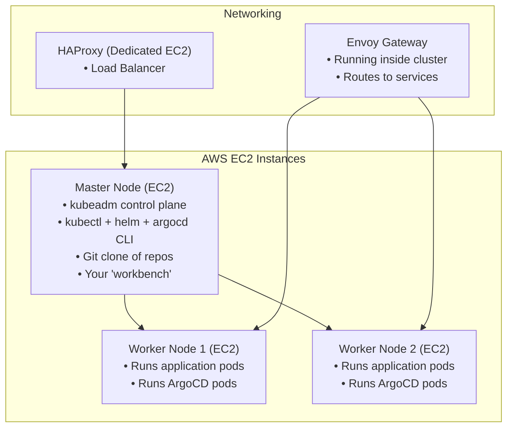
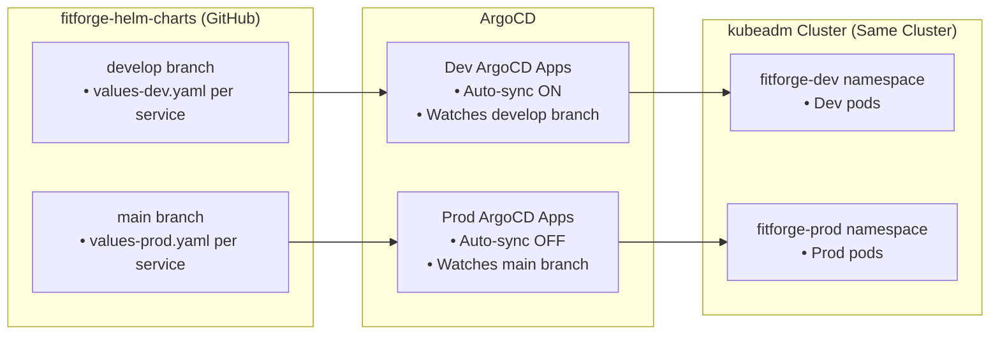
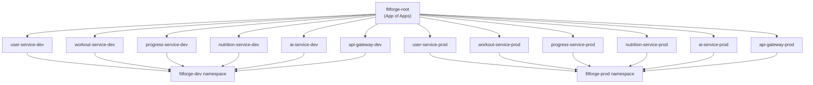

# FitForge CD Pipeline — ArgoCD + GitOps Complete Walkthrough

> **Audience**: Aswin — implementing CD for FitForge's multi-repo microservices  
> **Stack**: GitHub Actions → Docker Hub → Helm Charts Repo → ArgoCD → Kubernetes  
> **Org**: `fitforge101`  
> **Infrastructure**: AWS EC2 — 1 Master Node + 2 Worker Nodes — kubeadm — Envoy Gateway

---

## Table of Contents

1. [Architecture Overview](#1-architecture-overview)
2. [Your Infrastructure](#2-your-infrastructure)
3. [Repository Layout](#3-repository-layout)
4. [Multi-Environment Strategy (Dev & Prod)](#4-multi-environment-strategy-dev--prod)
5. [Prerequisites](#5-prerequisites)
6. [Part 1 — Install ArgoCD on Your kubeadm Cluster](#6-part-1--install-argocd-on-your-kubeadm-cluster)
7. [Part 2 — Access the ArgoCD Dashboard](#7-part-2--access-the-argocd-dashboard)
8. [Part 3 — ArgoCD CLI Setup (On Master Node)](#8-part-3--argocd-cli-setup-on-master-node)
9. [Part 4 — OIDC / SSO with GitHub (Dex)](#9-part-4--oidc--sso-with-github-dex)
10. [Part 5 — RBAC (Role-Based Access Control)](#10-part-5--rbac-role-based-access-control)
11. [Part 6 — Helm Charts Repo Structure (Multi-Environment)](#11-part-6--helm-charts-repo-structure-multi-environment)
12. [Part 7 — Validating Helm Charts Before Deploying](#12-part-7--validating-helm-charts-before-deploying)
13. [Part 8 — ArgoCD Application Manifests (Dev & Prod)](#13-part-8--argocd-application-manifests-dev--prod)
14. [Part 9 — App of Apps Pattern](#14-part-9--app-of-apps-pattern)
15. [Part 10 — GitHub Actions CD Workflow](#15-part-10--github-actions-cd-workflow)
16. [Part 11 — ArgoCD Image Updater (Alternative)](#16-part-11--argocd-image-updater-alternative)
17. [Part 12 — Deployment Strategies](#17-part-12--deployment-strategies)
18. [Part 13 — End-to-End Flow Walkthrough](#18-part-13--end-to-end-flow-walkthrough)
19. [Troubleshooting](#19-troubleshooting)
20. [Best Practices Checklist](#20-best-practices-checklist)

---

## 1. Architecture Overview

Here's the complete CI/CD flow for FitForge:

```mermaid
flowchart LR
    subgraph DEV["Developer"]
        A["Push Code"]
    end

    subgraph CI["GitHub Actions — CI"]
        B["Checkout Code"]
        C["SAST + Snyk"]
        D["Install Deps + Build"]
        E["Build Docker Image"]
        F["Trivy Scan"]
        G["Push to Docker Hub"]
    end

    subgraph CD["GitHub Actions — CD"]
        H["Checkout Helm Repo"]
        I["Update image tag"]
        J["Commit + Push"]
    end

    subgraph GITOPS["ArgoCD"]
        K["Detect Git Change"]
        L["Sync to Cluster"]
    end

    subgraph K8S["kubeadm Cluster on EC2"]
        M["Pull New Image"]
        N["Rolling Update Pods"]
    end

    A --> B --> C --> D --> E --> F --> G --> H --> I --> J --> K --> L --> M --> N
```



### The GitOps Principle

> **Git is the single source of truth.** Every change to infrastructure or application configuration is made through a Git commit. ArgoCD watches Git and ensures the live cluster matches what's declared in the repository.

**Key Idea**: Your CI pipeline **never** talks to Kubernetes directly. It only:
1. Builds + pushes the Docker image
2. Updates the Helm chart repo with the new image tag

ArgoCD handles the rest — pulling manifests from Git and applying them to the cluster.

---

## 2. Your Infrastructure

This walkthrough is tailored for your exact setup:



### Key Facts About Your Setup

| Component | Details |
|---|---|
| **Cluster type** | kubeadm (self-managed, NOT EKS) |
| **Master node** | 1 EC2 instance — runs control plane components |
| **Worker nodes** | 2 EC2 instances — run application pods |
| **Load balancer** | HAProxy on a dedicated EC2 instance |
| **API Gateway** | Envoy Gateway (Kubernetes Gateway API) — **NOT NGINX Ingress** |
| **Container registry** | Docker Hub |
| **Secret management** | Sealed Secrets |
| **Observability** | Prometheus + Grafana + Node Exporter + kube-state-metrics |

> [!IMPORTANT]
> Since you are using a **kubeadm** self-managed cluster, your **Master Node is your workbench**. You SSH into it to run `kubectl`, `helm`, `git`, and `argocd` commands. All commands in this walkthrough are meant to be run from your Master Node unless stated otherwise.

---

## 3. Repository Layout

Your multi-repo organization:

```
fitforge101/
├── fitforge-user-service          # Microservice repo (Node.js)
├── fitforge-workout-service       # Microservice repo (Node.js)
├── fitforge-progress-service      # Microservice repo (Node.js)
├── fitforge-nutrition-service     # Microservice repo (Node.js)
├── fitforge-ai-service            # Microservice repo (Python)
├── fitforge-api-gateway           # API Gateway repo
├── fitforge-frontend              # Frontend repo
├── fitforge-shared                # Reusable CI/CD workflows repo
└── fitforge-helm-charts           # ← GitOps repo (Helm charts + ArgoCD manifests)
```

> [!IMPORTANT]
> The `fitforge-helm-charts` repo is your **GitOps repo** — the single source of truth for what's deployed in your cluster. ArgoCD watches ONLY this repo.

---

## 4. Multi-Environment Strategy (Dev & Prod)

This is the critical design decision. Instead of manually testing with `kubectl apply` and then switching to ArgoCD, you use ArgoCD for BOTH environments from the start.

### How It Works



### The Workflow

| Step | What Happens | Who Does It |
|---|---|---|
| 1 | Developer pushes code to service repo's `develop` branch | You |
| 2 | GitHub Actions CI builds Docker image with `dev-<SHA>` tag | Automated |
| 3 | GitHub Actions CD updates `develop` branch of Helm repo | Automated |
| 4 | ArgoCD **auto-syncs** to `fitforge-dev` namespace | Automated |
| 5 | You test in dev. If it's broken, push a fix. If it works, continue. | You |
| 6 | You merge `develop` → `main` in the Helm repo (via PR) | You |
| 7 | ArgoCD detects the change in `main` but does NOT auto-sync | Automated detection |
| 8 | You click **"Sync"** in ArgoCD UI to deploy to `fitforge-prod` | You (manual approval) |

### Why This Is Better Than Manual `kubectl apply` Testing

1. **Same process for Dev and Prod** — You practice GitOps from day one
2. **If Master Node dies** — You rebuild it with `kubeadm`, install ArgoCD, point it at Git, and everything recreates itself
3. **Audit trail** — Every deployment is a Git commit. You can see who deployed what, when
4. **Rollback** — Just `git revert` a commit and ArgoCD rolls back automatically
5. **No "it works on my machine"** — ArgoCD deploys from Git, not from your local files

---

## 5. Prerequisites

Before starting, make sure you have these on your **Master Node**:

| Requirement | How to Check / Install |
|---|---|
| **kubectl** | `kubectl version` — Already configured if kubeadm is working |
| **Helm 3** | `helm version` — Install: see below |
| **Git** | `git --version` — Usually pre-installed on EC2 Amazon Linux / Ubuntu |
| **Docker Hub account** | With access token created at hub.docker.com |
| **GitHub Organization** | `fitforge101` with all repos created |
| **GitHub PAT** | Fine-grained token with `repo` scope for cross-repo commits |

### Install Helm on Master Node

```bash
# Download and install Helm 3
curl https://raw.githubusercontent.com/helm/helm/main/scripts/get-helm-3 | bash

# Verify
helm version
```

### Clone Your Helm Charts Repo on Master Node

```bash
# SSH into your Master Node
ssh -i your-key.pem ubuntu@<master-node-ip>

# Create a workspace directory
mkdir -p ~/fitforge && cd ~/fitforge

# Clone the GitOps repo
git clone https://github.com/fitforge101/fitforge-helm-charts.git
cd fitforge-helm-charts
```

> [!TIP]
> Your Master Node is now your **Development Workbench**. You will edit Helm charts here, validate them locally with `helm lint` and `helm template`, and then `git push` to GitHub. ArgoCD (running inside the cluster) picks up the changes automatically.

---

## 6. Part 1 — Install ArgoCD on Your kubeadm Cluster

All these commands are run on your **Master Node** (where `kubectl` is configured).

### Step 1: Create the ArgoCD Namespace

```bash
kubectl create namespace argocd
```

### Step 2: Install ArgoCD

We'll use the standard (non-HA) install since you have 2 worker nodes. For a production cluster with more nodes, use HA manifests.

```bash
# Install the stable release
kubectl apply -n argocd -f https://raw.githubusercontent.com/argoproj/argo-cd/stable/manifests/install.yaml
```

> [!NOTE]
> This downloads the YAML manifests from GitHub and applies them to your cluster. The ArgoCD pods will be scheduled on your **Worker Nodes** (not the Master, since kubeadm taints the Master by default).

### Step 3: Wait for All Pods to Be Ready

```bash
# Watch the pods come up (Ctrl+C to exit)
kubectl get pods -n argocd -w
```

Expected output (all pods should reach `Running` — this may take 1-2 minutes):

```
NAME                                                READY   STATUS    RESTARTS   AGE
argocd-application-controller-0                     1/1     Running   0          90s
argocd-applicationset-controller-xxx                1/1     Running   0          90s
argocd-dex-server-xxx                               1/1     Running   0          90s
argocd-notifications-controller-xxx                 1/1     Running   0          90s
argocd-redis-xxx                                    1/1     Running   0          90s
argocd-repo-server-xxx                              1/1     Running   0          90s
argocd-server-xxx                                   1/1     Running   0          90s
```

### Step 4: Verify Services

```bash
kubectl get svc -n argocd
```

You'll see `argocd-server` as a `ClusterIP` service by default. We'll expose it in the next part.

---

## 7. Part 2 — Access the ArgoCD Dashboard

Since you're on EC2 with kubeadm and Envoy Gateway, here are your options:

### Option A: NodePort (Simplest for EC2 — Recommended to Start)

Expose ArgoCD on a NodePort so you can access it from your browser via the EC2 public IP:

```bash
# Change argocd-server service type to NodePort
kubectl patch svc argocd-server -n argocd -p '{"spec": {"type": "NodePort"}}'

# Find the assigned NodePort
kubectl get svc argocd-server -n argocd
```

Output will look like:
```
NAME            TYPE       CLUSTER-IP      EXTERNAL-IP   PORT(S)                      AGE
argocd-server   NodePort   10.96.123.456   <none>        80:31234/TCP,443:31567/TCP   5m
```

The port `31567` (your number will be different) is the HTTPS NodePort.

**Access it:**
1. Make sure your **EC2 Security Group** allows inbound traffic on that port (e.g., `31567`)
2. Open in browser: `https://<master-or-worker-node-public-ip>:31567`

> [!WARNING]
> You need to add the NodePort to your **EC2 Security Group** inbound rules:
> - **Type**: Custom TCP
> - **Port range**: The NodePort number (e.g., `31567`)
> - **Source**: Your IP or `0.0.0.0/0` (for testing only — restrict in production!)

### Option B: Port Forward via SSH Tunnel (No Security Group Changes)

If you don't want to open extra ports on EC2:

```bash
# On your Master Node, start port-forward
kubectl port-forward svc/argocd-server -n argocd 8080:443 --address 0.0.0.0 &
```

Then create an SSH tunnel from your local PC:

```bash
# On your local PC (Windows/Mac)
ssh -i your-key.pem -L 8080:localhost:8080 ubuntu@<master-node-ip>
```

Open in browser: `https://localhost:8080`

### Option C: Envoy Gateway Route (Production — After Initial Setup)

Once ArgoCD is working, you can expose it properly via your Envoy Gateway. Create an `HTTPRoute`:

```yaml
# argocd-httproute.yaml
apiVersion: gateway.networking.k8s.io/v1
kind: HTTPRoute
metadata:
  name: argocd-route
  namespace: argocd
spec:
  parentRefs:
    - name: eg                           # Your Envoy Gateway name
      namespace: envoy-gateway-system    # Your Envoy Gateway namespace
  hostnames:
    - "argocd.fitforge.dev"              # Your domain (or use nip.io for testing)
  rules:
    - matches:
        - path:
            type: PathPrefix
            value: /
      backendRefs:
        - name: argocd-server
          namespace: argocd
          port: 443
```

```bash
kubectl apply -f argocd-httproute.yaml
```

> [!NOTE]
> For Option C to work, you need:
> 1. Envoy Gateway already installed and a `Gateway` resource created
> 2. DNS pointing `argocd.fitforge.dev` to your HAProxy → Envoy Gateway
> 3. TLS configured (either via cert-manager or your HAProxy)
> 
> **Start with Option A (NodePort) to get ArgoCD up fast. Move to Option C later.**

### Get the Initial Admin Password

```bash
# The initial password is auto-generated and stored in a Kubernetes secret
kubectl -n argocd get secret argocd-initial-admin-secret -o jsonpath="{.data.password}" | base64 -d && echo
```

**Login credentials:**
- **Username**: `admin`
- **Password**: (output of the command above)

> [!WARNING]
> **Change this password immediately** after first login! We'll set up GitHub OIDC login in Part 4 and disable this admin account.

---

## 8. Part 3 — ArgoCD CLI Setup (On Master Node)

Install the ArgoCD CLI on your **Master Node** so you can manage ArgoCD from the terminal.

### Install the CLI

```bash
# Download the latest ArgoCD CLI binary (Linux AMD64 — EC2 is x86_64)
curl -sSL -o argocd https://github.com/argoproj/argo-cd/releases/latest/download/argocd-linux-amd64
chmod +x argocd
sudo mv argocd /usr/local/bin/

# Verify installation
argocd version --client
```

### Login via CLI

```bash
# If using NodePort (Option A)
argocd login <master-node-ip>:<nodeport> --insecure

# If using port-forward (Option B)
argocd login localhost:8080 --insecure
```

Enter `admin` and the password you retrieved earlier.

### Change Admin Password (Do This Immediately!)

```bash
argocd account update-password
```

### Verify Cluster Connection

Since ArgoCD is running **inside** your kubeadm cluster, it automatically has access to the local cluster:

```bash
argocd cluster list
```

Expected output:
```
SERVER                          NAME        VERSION  STATUS   MESSAGE
https://kubernetes.default.svc  in-cluster  1.28     Successful
```

> [!NOTE]
> You do NOT need to run `argocd cluster add`. When ArgoCD runs inside the cluster it manages, it uses the in-cluster service account automatically (`https://kubernetes.default.svc`).

---

## 9. Part 4 — OIDC / SSO with GitHub (Dex)

This sets up **"Login via GitHub"** for ArgoCD. GitHub's OAuth is not strictly OIDC-compliant, so ArgoCD uses **Dex** (bundled with ArgoCD) as an identity broker.

### Step 1: Create a GitHub OAuth App

1. Go to **GitHub** → Your Organization `fitforge101` → **Settings**
2. Navigate to **Developer settings** → **OAuth Apps** → **New OAuth App**
3. Fill in:
   - **Application name**: `ArgoCD FitForge`
   - **Homepage URL**: `https://<your-argocd-url>` (e.g., `https://<master-ip>:<nodeport>` for now)
   - **Authorization callback URL**: `https://<your-argocd-url>/api/dex/callback`

> [!IMPORTANT]
> The **callback URL must exactly match** the URL you use to access ArgoCD. If you're using NodePort:
> `https://<master-ip>:31567/api/dex/callback`
> 
> When you later move to Envoy Gateway with a domain, you'll update this to:
> `https://argocd.fitforge.dev/api/dex/callback`

4. Click **Register application**
5. Note down the **Client ID**
6. Click **Generate a new client secret** → copy it immediately

### Step 2: Store the Client Secret in Kubernetes

Run this on your **Master Node**:

```bash
# Patch the existing argocd-secret (recommended approach)
kubectl -n argocd patch secret argocd-secret \
  --type='json' \
  -p='[
    {
      "op": "add",
      "path": "/data/dex.github.clientSecret",
      "value": "'$(echo -n "YOUR_GITHUB_CLIENT_SECRET_HERE" | base64)'"
    }
  ]'
```

> Replace `YOUR_GITHUB_CLIENT_SECRET_HERE` with your actual secret.

### Step 3: Configure the `argocd-cm` ConfigMap

```bash
kubectl edit configmap argocd-cm -n argocd
```

Add the following to the `data` section:

```yaml
data:
  # ← Use your actual ArgoCD URL
  url: https://<master-ip>:<nodeport>

  dex.config: |
    connectors:
      - type: github
        id: github
        name: GitHub
        config:
          clientID: YOUR_GITHUB_CLIENT_ID
          clientSecret: $dex.github.clientSecret
          orgs:
            - name: fitforge101
              # Optionally restrict to specific teams:
              # teams:
              #   - devops
              #   - developers
```

### Step 4: Restart Dex to Apply Changes

```bash
kubectl rollout restart deployment argocd-dex-server -n argocd

# Wait for it to come back up
kubectl get pods -n argocd -l app.kubernetes.io/name=argocd-dex-server -w
```

### Step 5: Verify

1. Open the ArgoCD Dashboard
2. You should now see a **"Log in via GitHub"** button alongside the admin login
3. Click it → Authorize the OAuth App → You're in!

### Step 6: (Optional) Disable the Admin Account

Once OIDC is confirmed working:

```bash
kubectl patch configmap argocd-cm -n argocd --type merge \
  -p '{"data": {"admin.enabled": "false"}}'

kubectl rollout restart deployment argocd-server -n argocd
```

---

## 10. Part 5 — RBAC (Role-Based Access Control)

Now that users can log in via GitHub, control **who can do what**.

### Configure RBAC via ConfigMap

```bash
kubectl edit configmap argocd-rbac-cm -n argocd
```

```yaml
data:
  # Default policy for authenticated users (read-only is safest)
  policy.default: role:readonly

  policy.csv: |
    # Organization admins get full admin access
    g, fitforge101:devops, role:admin

    # Developers can sync and view but not delete
    p, role:developer, applications, get, */*, allow
    p, role:developer, applications, sync, */*, allow
    p, role:developer, applications, action/*, */*, allow
    p, role:developer, logs, get, */*, allow
    g, fitforge101:developers, role:developer

  # How ArgoCD reads group information from the OIDC token
  scopes: '[groups]'
```

**What this means:**

| GitHub Team | ArgoCD Role | Permissions |
|---|---|---|
| `fitforge101:devops` | `admin` | Full access — create, sync, delete apps |
| `fitforge101:developers` | `developer` | Can view and sync apps, view logs. Cannot delete |
| Everyone else | `readonly` | Can view apps and status only |

---

## 11. Part 6 — Helm Charts Repo Structure (Multi-Environment)

This is how your `fitforge-helm-charts` repo should be structured to support **Dev and Prod** environments.

### Directory Structure

```
fitforge-helm-charts/
│
├── charts/                                # All Helm charts
│   ├── user-service/
│   │   ├── Chart.yaml
│   │   ├── values.yaml                    # ← Shared defaults
│   │   ├── values-dev.yaml                # ← Dev overrides (image tag, replicas, etc.)
│   │   ├── values-prod.yaml               # ← Prod overrides
│   │   └── templates/
│   │       ├── deployment.yaml
│   │       ├── service.yaml
│   │       ├── configmap.yaml
│   │       ├── sealed-secret.yaml
│   │       ├── hpa.yaml
│   │       └── _helpers.tpl
│   │
│   ├── workout-service/
│   │   ├── Chart.yaml
│   │   ├── values.yaml
│   │   ├── values-dev.yaml
│   │   ├── values-prod.yaml
│   │   └── templates/
│   │       └── ...
│   │
│   ├── progress-service/
│   │   └── ...
│   ├── nutrition-service/
│   │   └── ...
│   ├── ai-service/
│   │   └── ...
│   └── api-gateway/
│       └── ...
│
├── argocd/                                # ArgoCD manifests
│   ├── projects/
│   │   └── fitforge-project.yaml          # AppProject with dev+prod namespaces
│   ├── root-app/                          # App of Apps Helm chart
│   │   ├── Chart.yaml
│   │   ├── values.yaml
│   │   └── templates/
│   │       └── applications.yaml
│   └── root-app-bootstrap.yaml            # The ONLY file you kubectl apply manually
│
└── README.md
```

### Example `values.yaml` (Shared Defaults)

This file contains settings common to ALL environments:

```yaml
# charts/ai-service/values.yaml

# ─── Image Configuration ───
image:
  repository: aswindevs/fitforge-ai-service
  tag: latest                     # ← Overridden per environment
  pullPolicy: IfNotPresent

# ─── Service ───
service:
  type: ClusterIP
  port: 5000

# ─── Probes ───
livenessProbe:
  httpGet:
    path: /health
    port: 5000
  initialDelaySeconds: 30
  periodSeconds: 10

readinessProbe:
  httpGet:
    path: /health
    port: 5000
  initialDelaySeconds: 5
  periodSeconds: 5
```

### Example `values-dev.yaml` (Dev Overrides)

```yaml
# charts/ai-service/values-dev.yaml
# ── Only the values that DIFFER from the base values.yaml ──

image:
  tag: dev-abc1234               # ← Updated by GitHub Actions CD on develop branch

replicaCount: 1                  # ← Fewer replicas in dev to save resources on EC2

resources:
  requests:
    memory: "128Mi"
    cpu: "100m"
  limits:
    memory: "256Mi"
    cpu: "250m"

env:
  LOG_LEVEL: "debug"
  USER_SERVICE_URL: "http://user-service.fitforge-dev.svc.cluster.local:3001"
```

### Example `values-prod.yaml` (Prod Overrides)

```yaml
# charts/ai-service/values-prod.yaml
# ── Only the values that DIFFER from the base values.yaml ──

image:
  tag: v1.0.5                   # ← Updated by GitHub Actions CD on main branch

replicaCount: 2                  # ← More replicas in prod for availability

resources:
  requests:
    memory: "256Mi"
    cpu: "250m"
  limits:
    memory: "512Mi"
    cpu: "500m"

env:
  LOG_LEVEL: "info"
  USER_SERVICE_URL: "http://user-service.fitforge-prod.svc.cluster.local:3001"
```

### Example `deployment.yaml` Template

```yaml
# charts/ai-service/templates/deployment.yaml
apiVersion: apps/v1
kind: Deployment
metadata:
  name: {{ include "ai-service.fullname" . }}
  labels:
    {{- include "ai-service.labels" . | nindent 4 }}
spec:
  replicas: {{ .Values.replicaCount }}
  selector:
    matchLabels:
      {{- include "ai-service.selectorLabels" . | nindent 6 }}
  strategy:
    type: RollingUpdate
    rollingUpdate:
      maxSurge: 1
      maxUnavailable: 0
  template:
    metadata:
      labels:
        {{- include "ai-service.selectorLabels" . | nindent 8 }}
    spec:
      containers:
        - name: {{ .Chart.Name }}
          image: "{{ .Values.image.repository }}:{{ .Values.image.tag }}"
          imagePullPolicy: {{ .Values.image.pullPolicy }}
          ports:
            - containerPort: {{ .Values.service.port }}
          {{- if .Values.env }}
          env:
            {{- range $key, $value := .Values.env }}
            - name: {{ $key }}
              value: {{ $value | quote }}
            {{- end }}
          {{- end }}
          resources:
            {{- toYaml .Values.resources | nindent 12 }}
          {{- if .Values.livenessProbe }}
          livenessProbe:
            {{- toYaml .Values.livenessProbe | nindent 12 }}
          {{- end }}
          {{- if .Values.readinessProbe }}
          readinessProbe:
            {{- toYaml .Values.readinessProbe | nindent 12 }}
          {{- end }}
```

---

## 12. Part 7 — Validating Helm Charts Before Deploying

> [!IMPORTANT]
> **Never push a broken Helm chart to Git.** Validate locally on your Master Node first, AND automate validation in GitHub Actions.

### Level 1: Validate on Master Node (Manual — While Writing Charts)

SSH into your Master Node and run these from your cloned `fitforge-helm-charts` repo:

#### a) Lint the Chart (Syntax Check)

```bash
cd ~/fitforge/fitforge-helm-charts

# Check for common YAML/Helm errors
helm lint charts/ai-service/

# Lint with environment-specific values
helm lint charts/ai-service/ -f charts/ai-service/values-dev.yaml
```

If there are errors, Helm will tell you exactly which file and line has the issue.

#### b) Render Templates (Logic Check — The Secret Weapon)

This renders your Helm templates into raw Kubernetes YAML **without** applying anything. Read the output to verify the image tag, ports, env vars, replicas, etc. are correct:

```bash
# Render with dev values
helm template ai-service-dev charts/ai-service/ \
  -f charts/ai-service/values.yaml \
  -f charts/ai-service/values-dev.yaml \
  --namespace fitforge-dev

# Render with prod values
helm template ai-service-prod charts/ai-service/ \
  -f charts/ai-service/values.yaml \
  -f charts/ai-service/values-prod.yaml \
  --namespace fitforge-prod
```

> [!TIP]
> Pipe the output to a file for easier review:
> ```bash
> helm template ai-service-dev charts/ai-service/ -f charts/ai-service/values-dev.yaml > /tmp/rendered-dev.yaml
> cat /tmp/rendered-dev.yaml
> ```

#### c) Dry-Run Against the Cluster (Kubernetes Validation)

This sends the rendered YAML to your kubeadm API server and asks: *"Would this work?"* — without actually creating anything:

```bash
helm template ai-service-dev charts/ai-service/ \
  -f charts/ai-service/values-dev.yaml \
  --namespace fitforge-dev | kubectl apply --dry-run=server -f -
```

If the output says `deployment.apps/ai-service configured (server dry run)` — it's valid!

#### d) ArgoCD Diff (After ArgoCD Is Set Up)

Once ArgoCD is running, you can compare your local files against the live cluster:

```bash
# Shows a diff of what would change if ArgoCD synced these local files
argocd app diff ai-service-dev --local charts/ai-service/
```

### Level 2: Automated Validation in GitHub Actions (CI Guardrail)

Add a validation job to your `fitforge-shared` repo that runs **every time someone pushes to the Helm repo**. This catches errors before ArgoCD ever sees them.

Create this workflow in the `fitforge-helm-charts` repo:

```yaml
# fitforge-helm-charts/.github/workflows/validate-charts.yml
name: Validate Helm Charts

on:
  push:
    branches: [develop, main]
  pull_request:
    branches: [develop, main]

jobs:
  validate:
    runs-on: ubuntu-latest
    steps:
      - name: Checkout
        uses: actions/checkout@v4

      - name: Install Helm
        uses: azure/setup-helm@v4
        with:
          version: 'latest'

      - name: Lint All Charts
        run: |
          echo "🔍 Linting all Helm charts..."
          for chart in charts/*/; do
            echo "──── Linting $chart ────"
            helm lint "$chart" || exit 1
            
            # Lint with dev values if they exist
            if [ -f "${chart}values-dev.yaml" ]; then
              echo "  └─ with values-dev.yaml"
              helm lint "$chart" -f "${chart}values-dev.yaml" || exit 1
            fi
            
            # Lint with prod values if they exist
            if [ -f "${chart}values-prod.yaml" ]; then
              echo "  └─ with values-prod.yaml"
              helm lint "$chart" -f "${chart}values-prod.yaml" || exit 1
            fi
          done
          echo "✅ All charts passed linting!"

      - name: Template All Charts (Render Check)
        run: |
          echo "📦 Rendering all Helm charts..."
          for chart in charts/*/; do
            chart_name=$(basename "$chart")
            echo "──── Templating $chart_name ────"
            
            # Render with dev values
            if [ -f "${chart}values-dev.yaml" ]; then
              helm template "${chart_name}-dev" "$chart" \
                -f "${chart}values-dev.yaml" \
                --namespace fitforge-dev > /dev/null || exit 1
              echo "  ✅ Dev rendering OK"
            fi
            
            # Render with prod values
            if [ -f "${chart}values-prod.yaml" ]; then
              helm template "${chart_name}-prod" "$chart" \
                -f "${chart}values-prod.yaml" \
                --namespace fitforge-prod > /dev/null || exit 1
              echo "  ✅ Prod rendering OK"
            fi
          done
          echo "✅ All charts rendered successfully!"
```

> [!TIP]
> **Best workflow**: Edit charts on Master Node → `helm lint` + `helm template` locally → `git push` → GitHub Actions validates again automatically → ArgoCD syncs only if validation passes.

---

## 13. Part 8 — ArgoCD Application Manifests (Dev & Prod)

An ArgoCD `Application` is a CRD that tells ArgoCD: *"Watch this Git repo/path, deploy it to this namespace, using these values."*

### Step 1: Create the ArgoCD Project

The project defines security boundaries — what repos are allowed and what namespaces can be deployed to:

```yaml
# argocd/projects/fitforge-project.yaml
apiVersion: argoproj.io/v1alpha1
kind: AppProject
metadata:
  name: fitforge
  namespace: argocd
spec:
  description: "FitForge Microservices Platform"

  # ─── Which repos ArgoCD can pull from ───
  sourceRepos:
    - "https://github.com/fitforge101/fitforge-helm-charts.git"

  # ─── Where ArgoCD can deploy to (both environments!) ───
  destinations:
    - namespace: fitforge-dev
      server: https://kubernetes.default.svc
    - namespace: fitforge-prod
      server: https://kubernetes.default.svc
    - namespace: argocd
      server: https://kubernetes.default.svc

  # ─── Allowed resource types ───
  clusterResourceWhitelist:
    - group: ""
      kind: Namespace

  namespaceResourceWhitelist:
    - group: "*"
      kind: "*"
```

Apply it on your Master Node:

```bash
kubectl apply -f argocd/projects/fitforge-project.yaml
```

### Step 2: Create Dev Application (Auto-Sync ON)

```yaml
# argocd/applications/ai-service-dev.yaml
apiVersion: argoproj.io/v1alpha1
kind: Application
metadata:
  name: ai-service-dev
  namespace: argocd
  labels:
    environment: dev
  finalizers:
    - resources-finalizer.argocd.argoproj.io
spec:
  project: fitforge

  # ─── Source: Watch the DEVELOP branch ───
  source:
    repoURL: https://github.com/fitforge101/fitforge-helm-charts.git
    targetRevision: develop              # ← Watches the develop branch
    path: charts/ai-service
    helm:
      valueFiles:
        - values.yaml                    # ← Base values
        - values-dev.yaml                # ← Dev overrides (image tag, replicas, etc.)

  # ─── Destination: Deploy to DEV namespace ───
  destination:
    server: https://kubernetes.default.svc
    namespace: fitforge-dev

  # ─── Sync Policy: FULLY AUTOMATED ───
  syncPolicy:
    automated:
      prune: true                        # Remove resources deleted from Git
      selfHeal: true                     # Revert any manual kubectl changes
    syncOptions:
      - CreateNamespace=true             # Create fitforge-dev if it doesn't exist
      - ApplyOutOfSyncOnly=true
    retry:
      limit: 3
      backoff:
        duration: 5s
        factor: 2
        maxDuration: 3m
```

### Step 3: Create Prod Application (Auto-Sync OFF — Manual Approval)

```yaml
# argocd/applications/ai-service-prod.yaml
apiVersion: argoproj.io/v1alpha1
kind: Application
metadata:
  name: ai-service-prod
  namespace: argocd
  labels:
    environment: prod
  finalizers:
    - resources-finalizer.argocd.argoproj.io
spec:
  project: fitforge

  # ─── Source: Watch the MAIN branch ───
  source:
    repoURL: https://github.com/fitforge101/fitforge-helm-charts.git
    targetRevision: main                 # ← Watches the main branch
    path: charts/ai-service
    helm:
      valueFiles:
        - values.yaml                    # ← Base values
        - values-prod.yaml               # ← Prod overrides

  # ─── Destination: Deploy to PROD namespace ───
  destination:
    server: https://kubernetes.default.svc
    namespace: fitforge-prod

  # ─── Sync Policy: MANUAL (No automated sync!) ───
  syncPolicy:
    # NOTE: No "automated" block! ArgoCD will detect changes but NOT auto-deploy.
    # You must click "Sync" in the ArgoCD UI or run: argocd app sync ai-service-prod
    syncOptions:
      - CreateNamespace=true
      - ApplyOutOfSyncOnly=true
    retry:
      limit: 3
      backoff:
        duration: 5s
        factor: 2
        maxDuration: 3m
```

### Key Difference Between Dev and Prod

| Setting | Dev | Prod |
|---|---|---|
| `targetRevision` | `develop` | `main` |
| `valueFiles` | `values-dev.yaml` | `values-prod.yaml` |
| `destination.namespace` | `fitforge-dev` | `fitforge-prod` |
| `syncPolicy.automated` | ✅ Yes (auto-deploy) | ❌ No (manual click required) |

### Step 4: Connect ArgoCD to Your Private Repo

If `fitforge-helm-charts` is private, ArgoCD needs credentials:

```bash
# Option A: Via ArgoCD CLI (easiest)
argocd repo add https://github.com/fitforge101/fitforge-helm-charts.git \
  --username <github-username> \
  --password <github-pat>
```

```bash
# Option B: Via Kubernetes Secret
kubectl apply -f - <<EOF
apiVersion: v1
kind: Secret
metadata:
  name: fitforge-helm-repo
  namespace: argocd
  labels:
    argocd.argoproj.io/secret-type: repository
type: Opaque
stringData:
  type: git
  url: https://github.com/fitforge101/fitforge-helm-charts.git
  username: <github-username>
  password: <github-pat>
EOF
```

---

## 14. Part 9 — App of Apps Pattern

Instead of manually `kubectl apply`-ing each Application manifest, create one **Root Application** that manages all the others.

### Step 1: Root App Helm Chart

```yaml
# argocd/root-app/Chart.yaml
apiVersion: v2
name: fitforge-root-app
description: Root Application that deploys all FitForge microservices (Dev + Prod)
version: 1.0.0
```

### Step 2: Root App Values

```yaml
# argocd/root-app/values.yaml
repoURL: https://github.com/fitforge101/fitforge-helm-charts.git
project: fitforge
destinationServer: https://kubernetes.default.svc

# ─── Dev Apps (auto-sync ON) ───
devApps:
  - name: user-service
    path: charts/user-service
  - name: workout-service
    path: charts/workout-service
  - name: progress-service
    path: charts/progress-service
  - name: nutrition-service
    path: charts/nutrition-service
  - name: ai-service
    path: charts/ai-service
  - name: api-gateway
    path: charts/api-gateway

# ─── Prod Apps (auto-sync OFF) ───
prodApps:
  - name: user-service
    path: charts/user-service
  - name: workout-service
    path: charts/workout-service
  - name: progress-service
    path: charts/progress-service
  - name: nutrition-service
    path: charts/nutrition-service
  - name: ai-service
    path: charts/ai-service
  - name: api-gateway
    path: charts/api-gateway
```

### Step 3: Root App Template

```yaml
# argocd/root-app/templates/applications.yaml

# ─── DEV APPLICATIONS (auto-sync ON) ───
{{- range .Values.devApps }}
---
apiVersion: argoproj.io/v1alpha1
kind: Application
metadata:
  name: {{ .name }}-dev
  namespace: argocd
  labels:
    environment: dev
  finalizers:
    - resources-finalizer.argocd.argoproj.io
spec:
  project: {{ $.Values.project }}
  source:
    repoURL: {{ $.Values.repoURL }}
    targetRevision: develop
    path: {{ .path }}
    helm:
      valueFiles:
        - values.yaml
        - values-dev.yaml
  destination:
    server: {{ $.Values.destinationServer }}
    namespace: fitforge-dev
  syncPolicy:
    automated:
      prune: true
      selfHeal: true
    syncOptions:
      - CreateNamespace=true
    retry:
      limit: 3
      backoff:
        duration: 5s
        factor: 2
        maxDuration: 3m
{{- end }}

# ─── PROD APPLICATIONS (auto-sync OFF — manual approval) ───
{{- range .Values.prodApps }}
---
apiVersion: argoproj.io/v1alpha1
kind: Application
metadata:
  name: {{ .name }}-prod
  namespace: argocd
  labels:
    environment: prod
  finalizers:
    - resources-finalizer.argocd.argoproj.io
spec:
  project: {{ $.Values.project }}
  source:
    repoURL: {{ $.Values.repoURL }}
    targetRevision: main
    path: {{ .path }}
    helm:
      valueFiles:
        - values.yaml
        - values-prod.yaml
  destination:
    server: {{ $.Values.destinationServer }}
    namespace: fitforge-prod
  syncPolicy:
    syncOptions:
      - CreateNamespace=true
    retry:
      limit: 3
      backoff:
        duration: 5s
        factor: 2
        maxDuration: 3m
{{- end }}
```

### Step 4: Bootstrap the Root App (Run This ONCE on Master Node)

```yaml
# argocd/root-app-bootstrap.yaml
apiVersion: argoproj.io/v1alpha1
kind: Application
metadata:
  name: fitforge-root
  namespace: argocd
spec:
  project: default
  source:
    repoURL: https://github.com/fitforge101/fitforge-helm-charts.git
    targetRevision: main
    path: argocd/root-app
  destination:
    server: https://kubernetes.default.svc
    namespace: argocd
  syncPolicy:
    automated:
      prune: true
      selfHeal: true
```

Apply it on your Master Node:

```bash
kubectl apply -f argocd/root-app-bootstrap.yaml
```

### What Happens Next



ArgoCD now manages **12 applications** (6 services × 2 environments) — all from a single `kubectl apply`!

To add a new service in the future, just add an entry to `argocd/root-app/values.yaml` and push. ArgoCD creates the new apps automatically.

---

## 15. Part 10 — GitHub Actions CD Workflow

After CI builds and pushes the Docker image, the CD step updates the Helm charts repo with the new image tag.

### Step 1: Create a GitHub PAT for Cross-Repo Access

1. Go to **GitHub** → **Settings** → **Developer settings** → **Personal access tokens** → **Fine-grained tokens**
2. Create a token with:
   - **Repository access**: `fitforge-helm-charts` only
   - **Permissions**: Contents (Read and Write)
3. Copy the token

### Step 2: Add Secrets at the Org Level

Go to `fitforge101` → **Settings** → **Secrets and variables** → **Actions** → **New organization secret**:

| Secret Name | Value |
|---|---|
| `HELM_REPO_PAT` | The PAT from Step 1 |
| `DOCKERHUB_USERNAME` | Your Docker Hub username |
| `DOCKERHUB_TOKEN` | Your Docker Hub access token |

This way, all repos in the org inherit these secrets.

### Step 3: Create the Reusable CD Workflow

```yaml
# fitforge-shared/.github/workflows/_cd-template.yml
name: _CD Template — Update Helm Chart

on:
  workflow_call:
    inputs:
      service-name:
        description: "Name of the microservice (e.g., user-service)"
        required: true
        type: string
      image-tag:
        description: "The Docker image tag to deploy"
        required: true
        type: string
      environment:
        description: "Target environment branch (develop or main)"
        required: true
        type: string
      helm-repo:
        description: "The GitOps Helm charts repository"
        required: false
        type: string
        default: "fitforge101/fitforge-helm-charts"
    secrets:
      HELM_REPO_PAT:
        description: "PAT with write access to the Helm charts repo"
        required: true

jobs:
  update-helm-chart:
    runs-on: ubuntu-latest
    steps:
      # ─── Step 1: Determine which branch and values file to update ───
      - name: Set Environment Config
        id: config
        run: |
          if [ "${{ inputs.environment }}" == "main" ]; then
            echo "branch=main" >> $GITHUB_OUTPUT
            echo "values_file=charts/${{ inputs.service-name }}/values-prod.yaml" >> $GITHUB_OUTPUT
            echo "env_name=prod" >> $GITHUB_OUTPUT
          else
            echo "branch=develop" >> $GITHUB_OUTPUT
            echo "values_file=charts/${{ inputs.service-name }}/values-dev.yaml" >> $GITHUB_OUTPUT
            echo "env_name=dev" >> $GITHUB_OUTPUT
          fi

      # ─── Step 2: Checkout the Helm Charts Repo ───
      - name: Checkout Helm Charts Repo
        uses: actions/checkout@v4
        with:
          repository: ${{ inputs.helm-repo }}
          token: ${{ secrets.HELM_REPO_PAT }}
          ref: ${{ steps.config.outputs.branch }}

      # ─── Step 3: Install yq for safe YAML manipulation ───
      - name: Install yq
        run: |
          sudo wget -qO /usr/local/bin/yq https://github.com/mikefarah/yq/releases/latest/download/yq_linux_amd64
          sudo chmod +x /usr/local/bin/yq

      # ─── Step 4: Update Image Tag ───
      - name: Update Image Tag in values file
        run: |
          VALUES_FILE="${{ steps.config.outputs.values_file }}"
          
          echo "📦 Service:     ${{ inputs.service-name }}"
          echo "🌍 Environment: ${{ steps.config.outputs.env_name }}"
          echo "📄 Values file: $VALUES_FILE"
          echo "🏷️  New tag:     ${{ inputs.image-tag }}"
          
          # Update the image tag using yq (safe YAML editing)
          yq eval '.image.tag = "${{ inputs.image-tag }}"' -i "$VALUES_FILE"
          
          echo ""
          echo "✅ Updated $VALUES_FILE:"
          cat "$VALUES_FILE"

      # ─── Step 5: Validate the chart before committing ───
      - name: Install Helm
        uses: azure/setup-helm@v4

      - name: Validate Helm Chart
        run: |
          echo "🔍 Validating Helm chart..."
          helm lint charts/${{ inputs.service-name }}/ \
            -f charts/${{ inputs.service-name }}/values.yaml \
            -f ${{ steps.config.outputs.values_file }}
          
          helm template ${{ inputs.service-name }} charts/${{ inputs.service-name }}/ \
            -f charts/${{ inputs.service-name }}/values.yaml \
            -f ${{ steps.config.outputs.values_file }} > /dev/null
          
          echo "✅ Helm chart is valid!"

      # ─── Step 6: Commit and Push ───
      - name: Commit and Push Changes
        run: |
          git config user.name "github-actions[bot]"
          git config user.email "github-actions[bot]@users.noreply.github.com"
          
          git add .
          
          # Only commit if there are actual changes
          if git diff --cached --quiet; then
            echo "⏭️  No changes detected. Skipping commit."
          else
            git commit -m "🚀 deploy(${{ inputs.service-name }}): update image to ${{ inputs.image-tag }} [${{ steps.config.outputs.env_name }}]

          Triggered by: ${{ github.repository }}@${{ github.sha }}
          Environment: ${{ steps.config.outputs.env_name }}
          Branch: ${{ steps.config.outputs.branch }}
          Workflow: ${{ github.server_url }}/${{ github.repository }}/actions/runs/${{ github.run_id }}"
            
            git push
            echo "✅ Helm chart updated and pushed to ${{ steps.config.outputs.branch }} branch!"
          fi
```

### Step 4: Call CD from Each Service's CI Workflow

Update each service's workflow. Example for AI service:

```yaml
# fitforge-ai-service/.github/workflows/ci-ai-service.yml
name: CI/CD — AI Agent Service

on:
  push:
    branches:
      - develop
      - main
  pull_request:
    branches:
      - develop
      - main

permissions:
  contents: write

jobs:
  # ─── CI Job (existing — builds, tests, pushes Docker image) ───
  ci:
    uses: fitforge101/fitforge-shared/.github/workflows/_ci-template.yml@main
    with:
      service-name: ai-service
      service-path: .
      runtime: python
      python-version: "3.11"
      environment: ${{ github.ref_name }}
    secrets: inherit

  # ─── CD Job (NEW — updates Helm chart with new image tag) ───
  cd:
    needs: ci
    if: github.event_name == 'push'       # Only on push, NOT on PRs
    uses: fitforge101/fitforge-shared/.github/workflows/_cd-template.yml@main
    with:
      service-name: ai-service
      image-tag: ${{ github.ref_name == 'main' && needs.ci.outputs.version || format('dev-{0}', github.sha) }}
      environment: ${{ github.ref_name }}
    secrets:
      HELM_REPO_PAT: ${{ secrets.HELM_REPO_PAT }}
```

### How the Environment Branching Works

```
Push to DEVELOP branch of fitforge-ai-service
  → CI builds image: aswindevs/fitforge-ai-service:dev-abc1234
  → CD updates DEVELOP branch of fitforge-helm-charts
    → Updates charts/ai-service/values-dev.yaml → image.tag: dev-abc1234
  → ArgoCD watches develop branch → auto-syncs to fitforge-dev namespace ✅

Push to MAIN branch of fitforge-ai-service
  → CI builds image: aswindevs/fitforge-ai-service:v1.0.5
  → CD updates MAIN branch of fitforge-helm-charts
    → Updates charts/ai-service/values-prod.yaml → image.tag: v1.0.5
  → ArgoCD watches main branch → detects change → waits for manual Sync ⏸️
  → You click "Sync" in ArgoCD UI → deploys to fitforge-prod namespace ✅
```

### Step 5: Ensure CI Outputs the Image Tag

Your `_ci-template.yml` needs to **output** the image tag so the CD job can use it:

```yaml
# In _ci-template.yml, add outputs to the job
jobs:
  build:
    outputs:
      version: ${{ steps.version.outputs.tag }}
    steps:
      # ... existing steps ...
      
      - name: Set Image Tag
        id: version
        run: |
          if [ "${{ github.ref_name }}" == "main" ]; then
            # Your existing semver logic
            echo "tag=v1.0.${{ github.run_number }}" >> $GITHUB_OUTPUT
          else
            echo "tag=dev-${{ github.sha }}" >> $GITHUB_OUTPUT
          fi
```

> [!IMPORTANT]
> The CD job has three critical guards:
> - `needs: ci` — Only runs after CI passes (tests, scans, image push)
> - `if: github.event_name == 'push'` — Only on actual pushes, NOT on pull requests
> - **Helm validation step** — Lints and templates the chart before committing to Git

---

## 16. Part 11 — ArgoCD Image Updater (Alternative)

> [!NOTE]
> This is an **alternative** to the GitHub Actions CD approach (Part 10). With Image Updater, you don't need the CD workflow — ArgoCD watches Docker Hub directly. **Pick one approach, not both.**

### When to Use Which

| Aspect | GitHub Actions CD (Part 10) | ArgoCD Image Updater |
|---|---|---|
| **Control** | Full control — you decide when to update | Automatic — polls Docker Hub on interval |
| **Auditability** | Clear commit trail from CI → Helm repo | Commits made by Image Updater bot |
| **Complexity** | More workflow code | More K8s configuration |
| **Best for** | Production, regulated environments | Dev/staging, fast iteration |
| **Recommended** | ✅ Yes — use this | For learning / quick setups |

### Install Image Updater (On Master Node)

```bash
kubectl apply -n argocd -f https://raw.githubusercontent.com/argoproj-labs/argocd-image-updater/stable/manifests/install.yaml

# Verify
kubectl get pods -n argocd | grep image-updater
```

### Configure Docker Hub Credentials

```bash
kubectl create -n argocd secret docker-registry dockerhub-creds \
  --docker-username=<your-dockerhub-username> \
  --docker-password=<your-dockerhub-access-token> \
  --docker-server=https://index.docker.io/v1/
```

### Configure Git Write-Back

```bash
kubectl -n argocd create secret generic git-creds \
  --from-literal=username=<github-username> \
  --from-literal=password=<github-pat>
```

### Annotate ArgoCD Applications

Add these annotations to any Application you want Image Updater to manage:

```yaml
metadata:
  annotations:
    argocd-image-updater.argoproj.io/image-list: app=aswindevs/fitforge-ai-service
    argocd-image-updater.argoproj.io/app.update-strategy: latest
    argocd-image-updater.argoproj.io/app.pull-secret: pullsecret:argocd/dockerhub-creds
    argocd-image-updater.argoproj.io/write-back-method: git:secret:argocd/git-creds
    argocd-image-updater.argoproj.io/write-back-target: "helmvalues:charts/ai-service/values-dev.yaml"
    argocd-image-updater.argoproj.io/app.helm.image-name: image.repository
    argocd-image-updater.argoproj.io/app.helm.image-tag: image.tag
```

### Update Strategies

| Strategy | Behavior | Use Case |
|---|---|---|
| `semver` | Updates to highest semver tag (e.g., `v1.2.3`) | Production with versioned releases |
| `latest` | Updates to most recently pushed tag | Dev/staging with commit-SHA tags |
| `digest` | Tracks a fixed tag, updates when digest changes | When using mutable tags |

---

## 17. Part 12 — Deployment Strategies

### Strategy 1: Rolling Update (Default — Start Here)

Built into Kubernetes. No extra tooling needed. Already configured in the Helm template above.

```yaml
# In deployment.yaml template
spec:
  strategy:
    type: RollingUpdate
    rollingUpdate:
      maxSurge: 1              # 1 extra pod during update
      maxUnavailable: 0        # Zero downtime
```

**How it works:**
1. ArgoCD updates the Deployment with the new image tag
2. Kubernetes creates a new pod with the new image
3. Once the new pod passes readiness probes → old pod is terminated
4. Repeat until all pods are updated

### Strategy 2: Blue-Green (Advanced — Requires Argo Rollouts)

```bash
# Install Argo Rollouts on your kubeadm cluster
kubectl create namespace argo-rollouts
kubectl apply -n argo-rollouts -f https://github.com/argoproj/argo-rollouts/releases/latest/download/install.yaml
```

Replace `Deployment` with `Rollout`:

```yaml
apiVersion: argoproj.io/v1alpha1
kind: Rollout
spec:
  strategy:
    blueGreen:
      activeService: ai-service-active
      previewService: ai-service-preview
      autoPromotionEnabled: true
      autoPromotionSeconds: 60
```

### Strategy 3: Canary (Advanced — Requires Argo Rollouts)

```yaml
apiVersion: argoproj.io/v1alpha1
kind: Rollout
spec:
  strategy:
    canary:
      steps:
        - setWeight: 10
        - pause: { duration: 5m }
        - setWeight: 30
        - pause: { duration: 5m }
        - setWeight: 60
        - pause: { duration: 5m }
        - setWeight: 100
```

> [!TIP]
> **Start with Rolling Updates.** Move to Blue-Green or Canary only when you have observability (Prometheus/Grafana) set up to monitor deployments — which you already do!

---

## 18. Part 13 — End-to-End Flow Walkthrough

Let's trace a complete deployment from code push to running pods on your EC2 kubeadm cluster.

### 🔄 Dev Deployment (Fully Automated)

```
1. You push code to fitforge-ai-service → develop branch
   │
   ▼
2. GitHub Actions CI triggers
   ├── Checkout source code
   ├── SAST (SonarQube) + Snyk scan
   ├── Install dependencies
   ├── Build application
   ├── Build Docker image: aswindevs/fitforge-ai-service:dev-abc1234
   ├── Trivy scan on Docker image
   ├── Login to Docker Hub
   └── Push image to Docker Hub ✅
   │
   ▼
3. GitHub Actions CD triggers (needs: ci)
   ├── Checkout fitforge-helm-charts (develop branch)
   ├── Update charts/ai-service/values-dev.yaml → image.tag: dev-abc1234
   ├── Helm lint + template (validate chart)
   ├── Commit: "🚀 deploy(ai-service): update image to dev-abc1234 [dev]"
   └── Push to develop branch ✅
   │
   ▼
4. ArgoCD (running on your Worker Nodes) detects change in develop branch
   │
   ▼
5. ArgoCD compares desired state (Git) vs live state (kubeadm cluster)
   ├── Detects image tag changed in values-dev.yaml
   └── Status → "OutOfSync"
   │
   ▼
6. ArgoCD auto-syncs (automated sync policy is ON for dev)
   ├── Renders Helm chart: helm template + values.yaml + values-dev.yaml
   ├── Applies to fitforge-dev namespace
   └── Status → "Synced" + "Healthy" ✅
   │
   ▼
7. Kubernetes (on your Worker Nodes) performs Rolling Update
   ├── Creates new pod with image:dev-abc1234 on Worker 1 or 2
   ├── Waits for readiness probe (/health) to pass
   ├── Terminates old pod
   └── All traffic goes to new version ✅
```

### 🚀 Prod Deployment (Manual Approval)

```
1. You're happy with the dev testing
   │
   ▼
2. You merge develop → main in fitforge-ai-service repo
   │
   ▼
3. GitHub Actions CI triggers on main branch
   ├── Same CI steps...
   ├── Build Docker image: aswindevs/fitforge-ai-service:v1.0.5
   └── Push to Docker Hub ✅
   │
   ▼
4. GitHub Actions CD triggers
   ├── Checkout fitforge-helm-charts (main branch)
   ├── Update charts/ai-service/values-prod.yaml → image.tag: v1.0.5
   └── Push to main branch ✅
   │
   ▼
5. ArgoCD detects change in main branch
   └── Status → "OutOfSync" ⚠️ (but does NOT auto-sync!)
   │
   ▼
6. You see "OutOfSync" in ArgoCD Dashboard
   ├── Option A: Click "Sync" button in ArgoCD UI
   └── Option B: Run on Master Node: argocd app sync ai-service-prod
   │
   ▼
7. ArgoCD syncs to fitforge-prod namespace
   └── Rolling update in production ✅
```

### Verify the Deployment (Run on Master Node)

```bash
# ─── Check ArgoCD status ───
argocd app list                                     # All apps + sync status
argocd app get ai-service-dev                       # Dev app details
argocd app get ai-service-prod                      # Prod app details
argocd app history ai-service-dev                   # Deployment history

# ─── Check pods ───
kubectl get pods -n fitforge-dev -l app=ai-service  # Dev pods
kubectl get pods -n fitforge-prod -l app=ai-service # Prod pods

# ─── Verify the running image ───
kubectl get pods -n fitforge-dev -l app=ai-service \
  -o jsonpath='{.items[*].spec.containers[*].image}'

# ─── Check which Worker Node pods are running on ───
kubectl get pods -n fitforge-dev -o wide
```

### Speed Up ArgoCD Sync (GitHub Webhook)

By default ArgoCD polls Git every **3 minutes**. Set up a webhook for instant sync:

1. Go to `fitforge-helm-charts` → **Settings** → **Webhooks** → **Add webhook**
2. **Payload URL**: `https://<argocd-url>/api/webhook`
3. **Content type**: `application/json`
4. **Secret**: Generate a random secret string
5. **Events**: Just the `push` event

Configure ArgoCD to accept the webhook:

```bash
kubectl patch configmap argocd-cm -n argocd --type merge \
  -p '{"data": {"webhook.github.secret": "<your-webhook-secret>"}}'
```

---

## 19. Troubleshooting

### Common Issues on kubeadm + EC2

| Problem | Cause | Solution |
|---|---|---|
| ArgoCD pods stuck in `Pending` | Not enough resources on worker nodes | Check `kubectl describe pod <pod> -n argocd` for resource constraints |
| Can't access ArgoCD UI | EC2 Security Group blocks port | Add NodePort to inbound rules |
| ArgoCD shows "Unknown" status | No health check configured | Add `livenessProbe` / `readinessProbe` to Helm chart |
| "ComparisonError" | Invalid Helm chart | Run `helm template` locally to debug |
| "OutOfSync" but won't sync | Auto-sync not enabled (Prod behavior) | Click "Sync" or run `argocd app sync <name>` |
| Image not pulling (`ImagePullBackOff`) | Wrong image tag or Docker Hub rate limit | Check `kubectl describe pod <name>` for details |
| CD job can't push to Helm repo | PAT lacks permissions | Ensure PAT has `Contents: Write` on `fitforge-helm-charts` |
| Dex callback error | Wrong callback URL | Must exactly match `https://<url>/api/dex/callback` |
| RBAC "permission denied" | Missing team membership | Check `argocd-rbac-cm` and GitHub team membership |
| Pods scheduled on Master Node | Missing taint | Run `kubectl taint nodes <master> node-role.kubernetes.io/control-plane:NoSchedule` |

### Useful Debug Commands (Run on Master Node)

```bash
# ─── ArgoCD Status ───
argocd app list                          # List all apps with status
argocd app get <app-name>                # Detailed app info
argocd app diff <app-name>               # What would change on sync
argocd app sync <app-name>               # Force manual sync
argocd app history <app-name>            # Deployment history
argocd app rollback <app-name> <id>      # Rollback to a previous version

# ─── ArgoCD Logs ───
kubectl logs -n argocd -l app.kubernetes.io/name=argocd-application-controller --tail=50
kubectl logs -n argocd -l app.kubernetes.io/name=argocd-server --tail=50
kubectl logs -n argocd -l app.kubernetes.io/name=argocd-repo-server --tail=50

# ─── Kubernetes Events ───
kubectl get events -n fitforge-dev --sort-by='.lastTimestamp' | tail -20
kubectl get events -n fitforge-prod --sort-by='.lastTimestamp' | tail -20

# ─── Pod Debugging ───
kubectl describe pod <pod-name> -n fitforge-dev
kubectl logs <pod-name> -n fitforge-dev
kubectl rollout status deployment/<name> -n fitforge-dev

# ─── Rollback (manual) ───
kubectl rollout undo deployment/<service-name> -n fitforge-prod
```

---

## 20. Best Practices Checklist

### Security
- [ ] Set up OIDC/GitHub SSO (Part 4)
- [ ] Disable the default `admin` account
- [ ] Use ArgoCD Projects to restrict access per environment
- [ ] Use Sealed Secrets for sensitive data (you already do this!)
- [ ] Use fine-grained PATs (not classic tokens)
- [ ] Ensure Master Node Security Group only allows SSH from your IP

### GitOps
- [ ] Separate source code repos from Helm charts repo ✅
- [ ] Use `develop` branch for Dev, `main` branch for Prod
- [ ] Never use `:latest` tag — always use commit SHA or semver
- [ ] CD job only runs on `push` events, never on PRs
- [ ] Use `yq` (not `sed`) for YAML manipulation
- [ ] Validate Helm charts in CI before committing

### ArgoCD Configuration
- [ ] Dev apps: auto-sync ON (fast iteration)
- [ ] Prod apps: auto-sync OFF (manual approval)
- [ ] Enable `selfHeal` to prevent `kubectl edit` drift
- [ ] Enable `prune` to clean up removed resources
- [ ] Set up GitHub webhooks for instant sync
- [ ] Use App of Apps pattern for managing all services

### Your kubeadm Cluster
- [ ] Master Node tainted (no application pods on Master)
- [ ] Worker Nodes have enough resources for ArgoCD + your services
- [ ] EC2 Security Groups properly configured
- [ ] Envoy Gateway routing configured for ArgoCD (after initial setup)
- [ ] HAProxy updated if exposing ArgoCD via domain

### Monitoring & Observability
- [ ] Expose ArgoCD Prometheus metrics (your Prometheus can scrape the ArgoCD pods)
- [ ] Create Grafana dashboard for deployment tracking
- [ ] Set up alerts for failed syncs
- [ ] Monitor ArgoCD pod resource usage on Worker Nodes

---

## Quick Reference: Implementation Order

Follow these steps in order on your **Master Node**:

| Step | Section | What You Do | Where |
|---|---|---|---|
| 1 | Part 1 | `kubectl apply` ArgoCD manifests | Master Node |
| 2 | Part 2 | Expose ArgoCD via NodePort, open Security Group | Master Node + AWS Console |
| 3 | Part 3 | Install ArgoCD CLI, login, change password | Master Node |
| 4 | Part 4 | Create GitHub OAuth App, configure Dex | GitHub + Master Node |
| 5 | Part 5 | Set up RBAC for teams | Master Node |
| 6 | Part 6 | Structure `fitforge-helm-charts` repo with values-dev/prod | Master Node (git clone + edit) |
| 7 | Part 7 | Run `helm lint` + `helm template` to validate | Master Node |
| 8 | Part 8 | Connect ArgoCD to your Git repo | Master Node |
| 9 | Part 9 | Apply the root-app-bootstrap.yaml (ONCE) | Master Node |
| 10 | Part 10 | Add `_cd-template.yml` to `fitforge-shared` | Master Node or local PC |
| 11 | Part 10 | Update each service's CI workflow to call CD | Master Node or local PC |
| 12 | Part 13 | Push a code change and watch the magic ✨ | Anywhere! |

---

## Quick Reference: File Locations

| What | Where |
|---|---|
| CI Workflow Template | `fitforge-shared/.github/workflows/_ci-template.yml` |
| **CD Workflow Template** | `fitforge-shared/.github/workflows/_cd-template.yml` |
| **Chart Validation Workflow** | `fitforge-helm-charts/.github/workflows/validate-charts.yml` |
| Service CI/CD Workflow | `fitforge-<service>/.github/workflows/ci-<service>.yml` |
| Helm Charts (all services) | `fitforge-helm-charts/charts/<service-name>/` |
| Dev Values | `fitforge-helm-charts/charts/<service>/values-dev.yaml` |
| Prod Values | `fitforge-helm-charts/charts/<service>/values-prod.yaml` |
| ArgoCD Project | `fitforge-helm-charts/argocd/projects/fitforge-project.yaml` |
| Root App (App of Apps) | `fitforge-helm-charts/argocd/root-app/` |
| Root App Bootstrap | `fitforge-helm-charts/argocd/root-app-bootstrap.yaml` |
| ArgoCD Config | `kubectl get cm argocd-cm -n argocd` (on Master Node) |
| ArgoCD RBAC | `kubectl get cm argocd-rbac-cm -n argocd` (on Master Node) |
