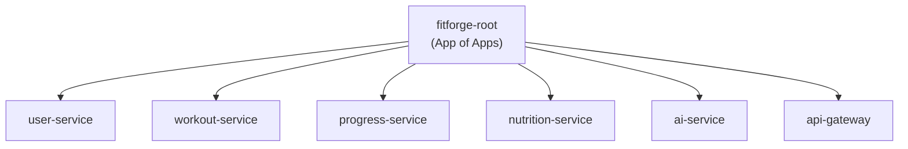

# FitForge CD Pipeline — ArgoCD + GitOps Complete Walkthrough

> **Audience**: You (Aswin), implementing CD for FitForge's multi-repo microservices  
> **Stack**: GitHub Actions → Docker Hub → Helm Charts Repo → ArgoCD → Kubernetes  
> **Org**: `fitforge101`

---

## Table of Contents

1. [Architecture Overview](#1-architecture-overview)
2. [Repository Layout](#2-repository-layout)
3. [Prerequisites](#3-prerequisites)
4. [Part 1 — Install ArgoCD on Kubernetes](#4-part-1--install-argocd-on-kubernetes)
5. [Part 2 — Access the ArgoCD Dashboard](#5-part-2--access-the-argocd-dashboard)
6. [Part 3 — ArgoCD CLI Setup](#6-part-3--argocd-cli-setup)
7. [Part 4 — OIDC / SSO with GitHub (Dex)](#7-part-4--oidc--sso-with-github-dex)
8. [Part 5 — RBAC (Role-Based Access Control)](#8-part-5--rbac-role-based-access-control)
9. [Part 6 — GitHub Actions CD Workflow](#9-part-6--github-actions-cd-workflow)
10. [Part 7 — Helm Charts Repo Structure](#10-part-7--helm-charts-repo-structure)
11. [Part 8 — ArgoCD Application Manifests](#11-part-8--argocd-application-manifests)
12. [Part 9 — App of Apps Pattern](#12-part-9--app-of-apps-pattern)
13. [Part 10 — ArgoCD Image Updater (Alternative)](#13-part-10--argocd-image-updater-alternative)
14. [Part 11 — Deployment Strategies](#14-part-11--deployment-strategies)
15. [Part 12 — End-to-End Flow Walkthrough](#15-part-12--end-to-end-flow-walkthrough)
16. [Troubleshooting](#16-troubleshooting)
17. [Best Practices Checklist](#17-best-practices-checklist)

---

## 1. Architecture Overview

Here's the complete CI/CD flow for FitForge:

```mermaid
flowchart LR
    subgraph DEV["Developer"]
        A["Push Code"]
    end

    subgraph CI["GitHub Actions — CI (Service Repo)"]
        B["Checkout Code"]
        C["SAST + Snyk"]
        D["Install Deps + Build"]
        E["Build Docker Image"]
        F["Trivy Scan"]
        G["Push to Docker Hub"]
    end

    subgraph CD["GitHub Actions — CD (Service Repo)"]
        H["Checkout Helm Repo"]
        I["Update image tag in values.yaml"]
        J["Commit + Push to Helm Repo"]
    end

    subgraph GITOPS["ArgoCD (Kubernetes)"]
        K["Detect Git Change"]
        L["Sync to Cluster"]
    end

    subgraph K8S["Kubernetes Cluster"]
        M["Pull New Image"]
        N["Rolling Update Pods"]
    end

    A --> B --> C --> D --> E --> F --> G --> H --> I --> J --> K --> L --> M --> N
```



### The GitOps Principle

> **Git is the single source of truth.** Every change to infrastructure or application configuration is made through a Git commit. ArgoCD watches Git and ensures the live cluster matches what's declared in the repository.

**Key Idea**: Your CI pipeline **never** talks to Kubernetes directly. It only:
1. Builds + pushes the Docker image
2. Updates the Helm chart repo with the new image tag

ArgoCD handles the rest — pulling manifests from Git and applying them to the cluster.

---

## 2. Repository Layout

Your multi-repo organization should look like this:

```
fitforge101/
├── fitforge-user-service          # Microservice repo (Node.js)
├── fitforge-workout-service       # Microservice repo (Node.js)
├── fitforge-progress-service      # Microservice repo (Node.js)
├── fitforge-nutrition-service     # Microservice repo (Node.js)
├── fitforge-ai-service            # Microservice repo (Python)
├── fitforge-api-gateway           # API Gateway repo
├── fitforge-frontend              # Frontend repo
├── fitforge-shared                # Reusable CI workflows repo
├── fitforge-helm-charts           # ← GitOps repo (Helm charts + ArgoCD manifests)
└── fitforge-infrastructure        # (Optional) Terraform/IaC repo
```

> [!IMPORTANT]
> The `fitforge-helm-charts` repo is your **GitOps repo** — the single source of truth for what's deployed in your cluster. ArgoCD watches ONLY this repo.

---

## 3. Prerequisites

Before starting, make sure you have:

| Requirement | Details |
|---|---|
| **Kubernetes cluster** | Your existing K8s cluster (EKS/self-managed) |
| **kubectl** | Configured with cluster access |
| **Helm 3** | Installed locally |
| **Docker Hub account** | With access token created |
| **GitHub Organization** | `fitforge101` with all repos created |
| **GitHub PAT** | Personal Access Token with `repo` scope (for cross-repo commits) |
| **Domain/Ingress** | Optional but recommended for ArgoCD dashboard |

---

## 4. Part 1 — Install ArgoCD on Kubernetes

### Step 1: Create the ArgoCD Namespace

```bash
kubectl create namespace argocd
```

### Step 2: Install ArgoCD

You have two options — **plain manifests** or **Helm chart**. We'll use **plain manifests** for simplicity (the official recommended way):

```bash
# Install the stable release (non-HA for learning; use HA manifests for production)
kubectl apply -n argocd -f https://raw.githubusercontent.com/argoproj/argo-cd/stable/manifests/install.yaml
```

> [!TIP]
> For **production HA** setup, use:
> ```bash
> kubectl apply -n argocd -f https://raw.githubusercontent.com/argoproj/argo-cd/stable/manifests/ha/install.yaml
> ```
> This deploys multiple replicas of the API server, repo server, and controller with leader election.

### Step 3: Verify Installation

```bash
kubectl get pods -n argocd
```

Expected output (all pods should be `Running`):

```
NAME                                                READY   STATUS    RESTARTS   AGE
argocd-application-controller-0                     1/1     Running   0          60s
argocd-applicationset-controller-xxx                1/1     Running   0          60s
argocd-dex-server-xxx                               1/1     Running   0          60s
argocd-notifications-controller-xxx                 1/1     Running   0          60s
argocd-redis-xxx                                    1/1     Running   0          60s
argocd-repo-server-xxx                              1/1     Running   0          60s
argocd-server-xxx                                   1/1     Running   0          60s
```

### Step 4: Check Services

```bash
kubectl get svc -n argocd
```

You'll see `argocd-server` as a `ClusterIP` service by default.

---

## 5. Part 2 — Access the ArgoCD Dashboard

### Option A: Port Forward (Quick Access / Development)

```bash
kubectl port-forward svc/argocd-server -n argocd 8080:443
```

Then open: `https://localhost:8080`

### Option B: NodePort (If No Ingress)

```bash
kubectl patch svc argocd-server -n argocd -p '{"spec": {"type": "NodePort"}}'
```

### Option C: Ingress (Production — Recommended)

If you're using **Envoy Gateway** or **NGINX Ingress Controller**, create an Ingress resource:

```yaml
# argocd-ingress.yaml
apiVersion: networking.k8s.io/v1
kind: Ingress
metadata:
  name: argocd-server-ingress
  namespace: argocd
  annotations:
    nginx.ingress.kubernetes.io/ssl-passthrough: "true"
    nginx.ingress.kubernetes.io/backend-protocol: "HTTPS"
spec:
  ingressClassName: nginx   # Change to your ingress class
  rules:
    - host: argocd.fitforge.dev   # Your domain
      http:
        paths:
          - path: /
            pathType: Prefix
            backend:
              service:
                name: argocd-server
                port:
                  number: 443
```

```bash
kubectl apply -f argocd-ingress.yaml
```

### Get the Initial Admin Password

```bash
# The initial password is stored in a Kubernetes secret
kubectl -n argocd get secret argocd-initial-admin-secret -o jsonpath="{.data.password}" | base64 -d
```

> [!WARNING]
> **Change this password immediately** after first login, or better yet, set up OIDC (Part 4) and disable the admin account entirely.

**Login credentials:**
- **Username**: `admin`
- **Password**: (output of the command above)

---

## 6. Part 3 — ArgoCD CLI Setup

### Install the CLI

```bash
# Linux
curl -sSL -o argocd https://github.com/argoproj/argo-cd/releases/latest/download/argocd-linux-amd64
chmod +x argocd
sudo mv argocd /usr/local/bin/

# macOS
brew install argocd

# Windows (with scoop)
scoop install argocd
```

### Login via CLI

```bash
# If using port-forward on localhost:8080
argocd login localhost:8080 --insecure

# If using a domain
argocd login argocd.fitforge.dev --insecure
```

### Change Admin Password (Do This First!)

```bash
argocd account update-password
```

### Add Your Cluster (if managing external clusters)

```bash
# List available contexts
kubectl config get-contexts

# Add a cluster
argocd cluster add <context-name>
```

> [!NOTE]
> If ArgoCD is deployed **inside** the cluster it manages, it uses the in-cluster service account automatically (`https://kubernetes.default.svc`). You don't need to add it explicitly.

---

## 7. Part 4 — OIDC / SSO with GitHub (Dex)

This is where we set up **Login via GitHub** for ArgoCD. GitHub's OAuth is not strictly OIDC-compliant, so ArgoCD uses **Dex** (bundled with ArgoCD) as an identity broker.

### Step 1: Create a GitHub OAuth App

1. Go to **GitHub** → Your Organization `fitforge101` → **Settings**
2. Navigate to **Developer settings** → **OAuth Apps** → **New OAuth App**
3. Fill in:
   - **Application name**: `ArgoCD FitForge`
   - **Homepage URL**: `https://argocd.fitforge.dev` (or your ArgoCD URL)
   - **Authorization callback URL**: `https://argocd.fitforge.dev/api/dex/callback`
4. Click **Register application**
5. Note down the **Client ID**
6. Click **Generate a new client secret** → copy it immediately

### Step 2: Store the Client Secret in Kubernetes

```bash
# Patch the existing argocd-secret (recommended approach)
kubectl -n argocd patch secret argocd-secret \
  --type='json' \
  -p='[
    {
      "op": "add",
      "path": "/data/dex.github.clientSecret",
      "value": "'$(echo -n "<YOUR_GITHUB_CLIENT_SECRET>" | base64)'"
    }
  ]'
```

### Step 3: Configure the `argocd-cm` ConfigMap

```bash
kubectl edit configmap argocd-cm -n argocd
```

Add the following to the `data` section:

```yaml
apiVersion: v1
kind: ConfigMap
metadata:
  name: argocd-cm
  namespace: argocd
data:
  url: https://argocd.fitforge.dev    # ← Your ArgoCD URL

  dex.config: |
    connectors:
      - type: github
        id: github
        name: GitHub
        config:
          clientID: <YOUR_GITHUB_CLIENT_ID>
          clientSecret: $dex.github.clientSecret    # ← References the K8s secret
          orgs:
            - name: fitforge101                     # ← Your GitHub org
              # Optionally restrict to specific teams:
              # teams:
              #   - devops
              #   - developers
```

### Step 4: Restart Dex to Apply Changes

```bash
kubectl rollout restart deployment argocd-dex-server -n argocd
```

### Step 5: Verify

1. Open ArgoCD Dashboard
2. You should now see a **"Log in via GitHub"** button
3. Click it → Authorize → You're in!

### Step 6: (Optional) Disable the Admin Account

Once OIDC is working, disable the built-in admin for security:

```bash
kubectl edit configmap argocd-cm -n argocd
```

Add:
```yaml
data:
  admin.enabled: "false"
```

```bash
kubectl rollout restart deployment argocd-server -n argocd
```

---

## 8. Part 5 — RBAC (Role-Based Access Control)

Now that users can log in via GitHub, you need to control **who can do what**.

### Configure RBAC via ConfigMap

```bash
kubectl edit configmap argocd-rbac-cm -n argocd
```

```yaml
apiVersion: v1
kind: ConfigMap
metadata:
  name: argocd-rbac-cm
  namespace: argocd
data:
  # Default policy for authenticated users (read-only is safest)
  policy.default: role:readonly

  policy.csv: |
    # Organization admins get full admin access
    g, fitforge101:devops, role:admin

    # Developers can sync but not delete
    p, role:developer, applications, get, */*, allow
    p, role:developer, applications, sync, */*, allow
    p, role:developer, applications, action/*, */*, allow
    p, role:developer, logs, get, */*, allow
    g, fitforge101:developers, role:developer

  # How ArgoCD reads group information from the OIDC token
  scopes: '[groups]'
```

**Explanation:**
- `g, fitforge101:devops, role:admin` → Members of the `devops` team in `fitforge101` org get admin
- `g, fitforge101:developers, role:developer` → Members of `developers` team get the custom developer role
- `policy.default: role:readonly` → Anyone else who logs in gets read-only access

---

## 9. Part 6 — GitHub Actions CD Workflow

This is the **heart of the CD pipeline**. After CI builds and pushes the Docker image, the CD step updates the Helm charts repo with the new image tag.

### Step 1: Create a GitHub PAT for Cross-Repo Access

1. Go to **GitHub** → **Settings** → **Developer settings** → **Personal access tokens** → **Fine-grained tokens**
2. Create a token with:
   - **Repository access**: `fitforge-helm-charts` only
   - **Permissions**: Contents (Read and Write)
3. Copy the token

### Step 2: Add Secrets to Your Service Repos

In **each microservice repo** (or at the org level), add these secrets:

| Secret Name | Value |
|---|---|
| `HELM_REPO_PAT` | The PAT from Step 1 |
| `DOCKERHUB_USERNAME` | Your Docker Hub username |
| `DOCKERHUB_TOKEN` | Your Docker Hub access token |

> [!TIP]
> **Set secrets at the organization level** in `fitforge101` → Settings → Secrets → Actions. This way, all repos inherit them automatically and you only manage them in one place.

### Step 3: Create the Reusable CD Workflow

Add this to your **`fitforge-shared`** repo as a reusable workflow:

```yaml
# fitforge-shared/.github/workflows/_cd-template.yml
name: _CD Template — Update Helm Chart

on:
  workflow_call:
    inputs:
      service-name:
        description: "Name of the microservice (e.g., user-service)"
        required: true
        type: string
      image-tag:
        description: "The Docker image tag to deploy"
        required: true
        type: string
      environment:
        description: "Target environment (develop or main)"
        required: true
        type: string
      helm-repo:
        description: "The GitOps Helm charts repository"
        required: false
        type: string
        default: "fitforge101/fitforge-helm-charts"
      helm-values-path:
        description: "Path to values.yaml in the Helm repo"
        required: false
        type: string
        default: ""
    secrets:
      HELM_REPO_PAT:
        description: "PAT with write access to the Helm charts repo"
        required: true

jobs:
  update-helm-chart:
    runs-on: ubuntu-latest
    steps:
      # ─── Step 1: Checkout the Helm Charts Repo ───
      - name: Checkout Helm Charts Repo
        uses: actions/checkout@v4
        with:
          repository: ${{ inputs.helm-repo }}
          token: ${{ secrets.HELM_REPO_PAT }}
          ref: main

      # ─── Step 2: Determine values.yaml Path ───
      - name: Set Values Path
        id: paths
        run: |
          if [ -n "${{ inputs.helm-values-path }}" ]; then
            echo "values_file=${{ inputs.helm-values-path }}" >> $GITHUB_OUTPUT
          else
            echo "values_file=charts/${{ inputs.service-name }}/values.yaml" >> $GITHUB_OUTPUT
          fi

      # ─── Step 3: Update Image Tag ───
      - name: Update Image Tag in values.yaml
        run: |
          VALUES_FILE="${{ steps.paths.outputs.values_file }}"
          
          echo "📦 Updating $VALUES_FILE"
          echo "🏷️  New tag: ${{ inputs.image-tag }}"
          
          # Use yq to safely update YAML (avoid sed pitfalls)
          # Install yq
          sudo wget -qO /usr/local/bin/yq https://github.com/mikefarah/yq/releases/latest/download/yq_linux_amd64
          sudo chmod +x /usr/local/bin/yq
          
          # Update the image tag
          yq eval '.image.tag = "${{ inputs.image-tag }}"' -i "$VALUES_FILE"
          
          echo "✅ Updated values.yaml:"
          cat "$VALUES_FILE"

      # ─── Step 4: Commit and Push ───
      - name: Commit and Push Changes
        run: |
          git config user.name "github-actions[bot]"
          git config user.email "github-actions[bot]@users.noreply.github.com"
          
          git add .
          
          # Only commit if there are actual changes
          if git diff --cached --quiet; then
            echo "⏭️  No changes detected. Skipping commit."
          else
            git commit -m "🚀 deploy(${{ inputs.service-name }}): update image to ${{ inputs.image-tag }}

          Triggered by: ${{ github.repository }}@${{ github.sha }}
          Environment: ${{ inputs.environment }}
          Workflow: ${{ github.server_url }}/${{ github.repository }}/actions/runs/${{ github.run_id }}"
            
            git push
            echo "✅ Helm chart updated and pushed!"
          fi
```

### Step 4: Call the CD Workflow from Each Service Repo

Update the CI workflow in each service repo to call the CD template **after** CI succeeds. Here's the updated workflow for the AI service as an example:

```yaml
# fitforge-ai-service/.github/workflows/ci-ai-service.yml
name: CI/CD — AI Agent Service

on:
  push:
    branches:
      - develop
      - main
  pull_request:
    branches:
      - develop
      - main

permissions:
  contents: write

jobs:
  # ─── CI Job (existing — builds, tests, pushes Docker image) ───
  ci:
    uses: fitforge101/fitforge-shared/.github/workflows/_ci-template.yml@main
    with:
      service-name: ai-service
      service-path: .
      runtime: python
      python-version: "3.11"
      environment: ${{ github.ref_name }}
    secrets: inherit

  # ─── CD Job (NEW — updates Helm chart with new image tag) ───
  cd:
    needs: ci        # ← Only runs AFTER CI succeeds
    if: github.event_name == 'push'    # ← Only on push, NOT on PRs
    uses: fitforge101/fitforge-shared/.github/workflows/_cd-template.yml@main
    with:
      service-name: ai-service
      image-tag: ${{ github.ref_name == 'main' && needs.ci.outputs.version || format('dev-{0}', github.sha) }}
      environment: ${{ github.ref_name }}
    secrets:
      HELM_REPO_PAT: ${{ secrets.HELM_REPO_PAT }}
```

> [!IMPORTANT]
> The CD job has two critical guards:
> - `needs: ci` — It only runs after CI passes (all tests, scans, image push)
> - `if: github.event_name == 'push'` — It only runs on actual pushes, NOT on pull requests (you don't want PRs auto-deploying!)

### Step 5: Ensure CI Outputs the Image Tag

Your `_ci-template.yml` needs to **output** the image tag so the CD job can use it. Add this to your CI template:

```yaml
# In _ci-template.yml, add outputs to the job
jobs:
  build:
    outputs:
      version: ${{ steps.version.outputs.tag }}
    steps:
      # ... existing steps ...
      
      - name: Set Image Tag
        id: version
        run: |
          if [ "${{ github.ref_name }}" == "main" ]; then
            # Your existing semver logic
            echo "tag=v1.0.${{ github.run_number }}" >> $GITHUB_OUTPUT
          else
            echo "tag=dev-${{ github.sha }}" >> $GITHUB_OUTPUT
          fi
```

---

## 10. Part 7 — Helm Charts Repo Structure

Your `fitforge-helm-charts` repo should be organized like this:

```
fitforge-helm-charts/
├── charts/
│   ├── user-service/
│   │   ├── Chart.yaml
│   │   ├── values.yaml          ← ArgoCD watches this
│   │   └── templates/
│   │       ├── deployment.yaml
│   │       ├── service.yaml
│   │       ├── configmap.yaml
│   │       ├── hpa.yaml
│   │       └── _helpers.tpl
│   │
│   ├── workout-service/
│   │   ├── Chart.yaml
│   │   ├── values.yaml
│   │   └── templates/
│   │       └── ...
│   │
│   ├── progress-service/
│   │   └── ...
│   │
│   ├── nutrition-service/
│   │   └── ...
│   │
│   ├── ai-service/
│   │   └── ...
│   │
│   └── api-gateway/
│       └── ...
│
├── argocd/                       ← ArgoCD Application manifests
│   ├── root-app.yaml             ← The "App of Apps" root
│   ├── projects/
│   │   └── fitforge-project.yaml
│   └── applications/             ← Individual Application manifests
│       ├── user-service.yaml
│       ├── workout-service.yaml
│       ├── progress-service.yaml
│       ├── nutrition-service.yaml
│       ├── ai-service.yaml
│       └── api-gateway.yaml
│
└── README.md
```

### Example `values.yaml` for a Service

```yaml
# charts/ai-service/values.yaml

# ─── Image Configuration ───
image:
  repository: aswindevs/fitforge-ai-service    # ← Your Docker Hub image
  tag: dev-abc1234                              # ← This gets updated by CD pipeline
  pullPolicy: IfNotPresent

# ─── Deployment ───
replicaCount: 2

# ─── Service ───
service:
  type: ClusterIP
  port: 5000

# ─── Resources ───
resources:
  requests:
    memory: "256Mi"
    cpu: "250m"
  limits:
    memory: "512Mi"
    cpu: "500m"

# ─── Environment Variables ───
env:
  GOOGLE_API_KEY: ""           # Injected via Sealed Secret
  JWT_SECRET: ""               # Injected via Sealed Secret
  USER_SERVICE_URL: "http://user-service:3001"

# ─── Probes ───
livenessProbe:
  httpGet:
    path: /health
    port: 5000
  initialDelaySeconds: 30
  periodSeconds: 10

readinessProbe:
  httpGet:
    path: /health
    port: 5000
  initialDelaySeconds: 5
  periodSeconds: 5
```

### Example `deployment.yaml` Template

```yaml
# charts/ai-service/templates/deployment.yaml
apiVersion: apps/v1
kind: Deployment
metadata:
  name: {{ include "ai-service.fullname" . }}
  labels:
    {{- include "ai-service.labels" . | nindent 4 }}
spec:
  replicas: {{ .Values.replicaCount }}
  selector:
    matchLabels:
      {{- include "ai-service.selectorLabels" . | nindent 6 }}
  template:
    metadata:
      labels:
        {{- include "ai-service.selectorLabels" . | nindent 8 }}
    spec:
      containers:
        - name: {{ .Chart.Name }}
          image: "{{ .Values.image.repository }}:{{ .Values.image.tag }}"
          imagePullPolicy: {{ .Values.image.pullPolicy }}
          ports:
            - containerPort: {{ .Values.service.port }}
          resources:
            {{- toYaml .Values.resources | nindent 12 }}
          {{- if .Values.livenessProbe }}
          livenessProbe:
            {{- toYaml .Values.livenessProbe | nindent 12 }}
          {{- end }}
          {{- if .Values.readinessProbe }}
          readinessProbe:
            {{- toYaml .Values.readinessProbe | nindent 12 }}
          {{- end }}
```

---

## 11. Part 8 — ArgoCD Application Manifests

An ArgoCD `Application` is a CRD that tells ArgoCD: *"Watch this Git repo/path, and deploy it to this namespace."*

### Step 1: Create an ArgoCD Project

Projects are security boundaries. Create one for FitForge:

```yaml
# argocd/projects/fitforge-project.yaml
apiVersion: argoproj.io/v1alpha1
kind: AppProject
metadata:
  name: fitforge
  namespace: argocd
spec:
  description: "FitForge Microservices Platform"

  # ─── Which repos ArgoCD can pull from ───
  sourceRepos:
    - "https://github.com/fitforge101/fitforge-helm-charts.git"

  # ─── Where ArgoCD can deploy to ───
  destinations:
    - namespace: fitforge
      server: https://kubernetes.default.svc
    - namespace: fitforge-dev
      server: https://kubernetes.default.svc

  # ─── What resource types ArgoCD can manage ───
  clusterResourceWhitelist:
    - group: ""
      kind: Namespace

  namespaceResourceWhitelist:
    - group: "*"
      kind: "*"
```

```bash
kubectl apply -f argocd/projects/fitforge-project.yaml
```

### Step 2: Create Application Manifests

Create one Application manifest per microservice:

```yaml
# argocd/applications/ai-service.yaml
apiVersion: argoproj.io/v1alpha1
kind: Application
metadata:
  name: ai-service
  namespace: argocd
  # Finalizer ensures child resources are cleaned up on deletion
  finalizers:
    - resources-finalizer.argocd.argoproj.io
spec:
  # ─── Project ───
  project: fitforge

  # ─── Source: Where to pull the Helm chart from ───
  source:
    repoURL: https://github.com/fitforge101/fitforge-helm-charts.git
    targetRevision: main
    path: charts/ai-service           # ← Path to the service's Helm chart
    helm:
      valueFiles:
        - values.yaml

  # ─── Destination: Where to deploy in the cluster ───
  destination:
    server: https://kubernetes.default.svc
    namespace: fitforge

  # ─── Sync Policy ───
  syncPolicy:
    automated:
      prune: true         # Remove resources no longer in Git
      selfHeal: true       # Revert manual kubectl changes
    syncOptions:
      - CreateNamespace=true
      - ApplyOutOfSyncOnly=true
    retry:
      limit: 3
      backoff:
        duration: 5s
        factor: 2
        maxDuration: 3m
```

Apply it:

```bash
kubectl apply -f argocd/applications/ai-service.yaml
```

### What Each Field Means

| Field | Purpose |
|---|---|
| `project` | Security boundary — links to the AppProject |
| `source.repoURL` | The Git repo to watch |
| `source.path` | Path within the repo containing the Helm chart |
| `source.targetRevision` | Branch/tag to track (usually `main`) |
| `destination.server` | The K8s API server (in-cluster = `https://kubernetes.default.svc`) |
| `destination.namespace` | Target namespace for deployment |
| `syncPolicy.automated.prune` | Delete K8s resources that no longer exist in Git |
| `syncPolicy.automated.selfHeal` | If someone does a manual `kubectl edit`, ArgoCD reverts it |
| `syncPolicy.retry` | Auto-retry failed syncs |

### Step 3: Connect ArgoCD to Your Private Repo

If `fitforge-helm-charts` is a private repo, ArgoCD needs credentials:

```bash
# Option A: Via CLI
argocd repo add https://github.com/fitforge101/fitforge-helm-charts.git \
  --username <github-username> \
  --password <github-pat>

# Option B: Via Kubernetes Secret
kubectl apply -f - <<EOF
apiVersion: v1
kind: Secret
metadata:
  name: fitforge-helm-repo
  namespace: argocd
  labels:
    argocd.argoproj.io/secret-type: repository
type: Opaque
stringData:
  type: git
  url: https://github.com/fitforge101/fitforge-helm-charts.git
  username: <github-username>
  password: <github-pat>
EOF
```

---

## 12. Part 9 — App of Apps Pattern

Instead of manually applying each Application manifest, use the **App of Apps** pattern — one root Application that manages all the others.

### Step 1: Create a Root App Helm Chart

```yaml
# argocd/root-app/Chart.yaml
apiVersion: v2
name: fitforge-root-app
description: Root Application that deploys all FitForge microservices
version: 1.0.0
```

```yaml
# argocd/root-app/values.yaml
apps:
  - name: user-service
    path: charts/user-service
    namespace: fitforge

  - name: workout-service
    path: charts/workout-service
    namespace: fitforge

  - name: progress-service
    path: charts/progress-service
    namespace: fitforge

  - name: nutrition-service
    path: charts/nutrition-service
    namespace: fitforge

  - name: ai-service
    path: charts/ai-service
    namespace: fitforge

  - name: api-gateway
    path: charts/api-gateway
    namespace: fitforge

# Global settings
repoURL: https://github.com/fitforge101/fitforge-helm-charts.git
targetRevision: main
project: fitforge
destinationServer: https://kubernetes.default.svc
```

### Step 2: Create the Template

```yaml
# argocd/root-app/templates/applications.yaml
{{- range .Values.apps }}
---
apiVersion: argoproj.io/v1alpha1
kind: Application
metadata:
  name: {{ .name }}
  namespace: argocd
  finalizers:
    - resources-finalizer.argocd.argoproj.io
spec:
  project: {{ $.Values.project }}
  source:
    repoURL: {{ $.Values.repoURL }}
    targetRevision: {{ $.Values.targetRevision }}
    path: {{ .path }}
    helm:
      valueFiles:
        - values.yaml
  destination:
    server: {{ $.Values.destinationServer }}
    namespace: {{ .namespace }}
  syncPolicy:
    automated:
      prune: true
      selfHeal: true
    syncOptions:
      - CreateNamespace=true
    retry:
      limit: 3
      backoff:
        duration: 5s
        factor: 2
        maxDuration: 3m
{{- end }}
```

### Step 3: Deploy the Root Application

This is the **ONLY** Application you create manually. Everything else is managed automatically:

```yaml
# argocd/root-app-bootstrap.yaml
apiVersion: argoproj.io/v1alpha1
kind: Application
metadata:
  name: fitforge-root
  namespace: argocd
spec:
  project: default
  source:
    repoURL: https://github.com/fitforge101/fitforge-helm-charts.git
    targetRevision: main
    path: argocd/root-app
  destination:
    server: https://kubernetes.default.svc
    namespace: argocd
  syncPolicy:
    automated:
      prune: true
      selfHeal: true
```

```bash
kubectl apply -f argocd/root-app-bootstrap.yaml
```

Now ArgoCD will:
1. Sync the root app → Render the Helm template → Create 6 child Application CRDs
2. Each child Application syncs its respective Helm chart → Deploys the microservice
3. When you add a new service, just add an entry to `values.yaml` — no manual `kubectl apply`!



---

## 13. Part 10 — ArgoCD Image Updater (Alternative)

> [!NOTE]
> This is an **alternative** to the GitHub Actions CD approach (Part 6). With Image Updater, you don't need the CD workflow at all — ArgoCD watches Docker Hub directly and auto-updates. Pick **one approach**, not both.

### When to Use Image Updater vs GitHub Actions CD

| Aspect | GitHub Actions CD (Part 6) | ArgoCD Image Updater |
|---|---|---|
| **Control** | Full control — you decide exactly when to update | Automatic — polls registry on interval |
| **Auditability** | Clear commit trail from CI → Helm repo | Commits made by Image Updater bot |
| **Complexity** | More workflow code | More K8s configuration |
| **Best for** | Production, regulated environments | Dev/staging, fast iteration |

### Step 1: Install Image Updater

```bash
kubectl apply -n argocd -f https://raw.githubusercontent.com/argoproj-labs/argocd-image-updater/stable/manifests/install.yaml
```

### Step 2: Verify

```bash
kubectl get pods -n argocd | grep image-updater
```

### Step 3: Configure Docker Hub Registry Access

```bash
kubectl create -n argocd secret docker-registry dockerhub-creds \
  --docker-username=<your-dockerhub-username> \
  --docker-password=<your-dockerhub-access-token> \
  --docker-server=https://index.docker.io/v1/
```

Then register it in the Image Updater config:

```bash
kubectl edit configmap argocd-image-updater-config -n argocd
```

```yaml
data:
  registries.conf: |
    registries:
      - name: Docker Hub
        api_url: https://registry-1.docker.io
        prefix: docker.io
        credentials: pullsecret:argocd/dockerhub-creds
        defaultns: library
        default: true
```

### Step 4: Configure Git Write-Back

For the Image Updater to commit changes back to your Helm repo, it needs Git credentials:

```bash
kubectl -n argocd create secret generic git-creds \
  --from-literal=username=<github-username> \
  --from-literal=password=<github-pat>
```

### Step 5: Annotate Your ArgoCD Applications

```yaml
apiVersion: argoproj.io/v1alpha1
kind: Application
metadata:
  name: ai-service
  namespace: argocd
  annotations:
    # ─── Image Updater Annotations ───
    argocd-image-updater.argoproj.io/image-list: app=aswindevs/fitforge-ai-service
    argocd-image-updater.argoproj.io/app.update-strategy: latest
    argocd-image-updater.argoproj.io/app.pull-secret: pullsecret:argocd/dockerhub-creds
    argocd-image-updater.argoproj.io/write-back-method: git:secret:argocd/git-creds
    argocd-image-updater.argoproj.io/write-back-target: "helmvalues:charts/ai-service/values.yaml"
    argocd-image-updater.argoproj.io/app.helm.image-name: image.repository
    argocd-image-updater.argoproj.io/app.helm.image-tag: image.tag
spec:
  # ... same as before ...
```

**Update Strategies:**

| Strategy | Behavior | Use Case |
|---|---|---|
| `semver` | Updates to highest semver tag (e.g., `v1.2.3`) | Production with versioned releases |
| `latest` | Updates to most recently pushed tag | Dev/staging with commit-SHA tags |
| `digest` | Tracks a fixed tag but updates when digest changes | When using mutable tags like `latest` |
| `name` | Alphabetical sorting of tag names | Custom tag naming conventions |

---

## 14. Part 11 — Deployment Strategies

### Strategy 1: Rolling Update (Default — Recommended to Start)

This is built into Kubernetes. No extra tooling needed.

```yaml
# In your Helm chart's deployment.yaml template
spec:
  strategy:
    type: RollingUpdate
    rollingUpdate:
      maxSurge: 1           # 1 extra pod during update
      maxUnavailable: 0     # Zero downtime
```

**How it works:**
1. ArgoCD updates the Deployment spec with new image tag
2. Kubernetes creates a new pod with the new image
3. Once the new pod passes readiness probes, the old pod is terminated
4. Repeat until all pods are updated

### Strategy 2: Blue-Green (Advanced — Requires Argo Rollouts)

For zero-downtime deployments with instant rollback:

```bash
# Install Argo Rollouts
kubectl create namespace argo-rollouts
kubectl apply -n argo-rollouts -f https://github.com/argoproj/argo-rollouts/releases/latest/download/install.yaml
```

Replace `Deployment` with `Rollout` in your Helm template:

```yaml
apiVersion: argoproj.io/v1alpha1
kind: Rollout
metadata:
  name: {{ include "ai-service.fullname" . }}
spec:
  replicas: {{ .Values.replicaCount }}
  strategy:
    blueGreen:
      activeService: ai-service-active
      previewService: ai-service-preview
      autoPromotionEnabled: true      # Auto-promote after checks pass
      autoPromotionSeconds: 60        # Wait 60s before promoting
  selector:
    matchLabels:
      app: ai-service
  template:
    # ... same pod template as before ...
```

### Strategy 3: Canary (Advanced — Requires Argo Rollouts)

For gradual traffic shifting:

```yaml
apiVersion: argoproj.io/v1alpha1
kind: Rollout
spec:
  strategy:
    canary:
      steps:
        - setWeight: 10          # Send 10% traffic to canary
        - pause: { duration: 5m }  # Wait 5 min, monitor metrics
        - setWeight: 30
        - pause: { duration: 5m }
        - setWeight: 60
        - pause: { duration: 5m }
        - setWeight: 100         # Full rollout
```

> [!TIP]
> **Start with Rolling Updates**. Move to Blue-Green or Canary only when you're comfortable with the basics and have proper observability (Prometheus/Grafana) to monitor deployments.

---

## 15. Part 12 — End-to-End Flow Walkthrough

Let's walk through a complete deployment from code change to running pods:

### 🔄 The Complete Flow

```
1. Developer pushes code to fitforge-ai-service (develop branch)
   │
   ▼
2. GitHub Actions CI Workflow triggers
   ├── Checkout source code
   ├── Run SAST (SonarQube)
   ├── Run Snyk (vulnerability scan)
   ├── Install dependencies
   ├── Build application
   ├── Build Docker image: aswindevs/fitforge-ai-service:dev-abc1234
   ├── Run Trivy scan
   ├── Login to Docker Hub
   └── Push image to Docker Hub
   │
   ▼
3. GitHub Actions CD Job triggers (needs: ci)
   ├── Checkout fitforge-helm-charts repo
   ├── Update charts/ai-service/values.yaml → image.tag: dev-abc1234
   ├── Commit: "🚀 deploy(ai-service): update image to dev-abc1234"
   └── Push to fitforge-helm-charts main branch
   │
   ▼
4. ArgoCD detects the Git change (polls every 3 minutes by default)
   │
   ▼
5. ArgoCD compares desired state (Git) vs live state (cluster)
   ├── Detects image tag changed: dev-old1234 → dev-abc1234
   └── Status becomes: "OutOfSync"
   │
   ▼
6. ArgoCD auto-syncs (because syncPolicy.automated is enabled)
   ├── Runs helm template to generate manifests
   ├── Applies updated Deployment to cluster
   └── Status becomes: "Synced" + "Healthy"
   │
   ▼
7. Kubernetes performs Rolling Update
   ├── Creates new pod with image:dev-abc1234
   ├── Waits for readiness probe to pass
   ├── Terminates old pod with image:dev-old1234
   └── All traffic now goes to new version ✅
```

### Verify the Deployment

```bash
# Check ArgoCD sync status
argocd app get ai-service

# Check pod status
kubectl get pods -n fitforge -l app=ai-service

# Check the running image
kubectl get pods -n fitforge -l app=ai-service -o jsonpath='{.items[*].spec.containers[*].image}'

# View ArgoCD application history
argocd app history ai-service
```

### Speed Up Sync (Optional)

By default, ArgoCD polls Git every 3 minutes. To make it near-instant, set up a **GitHub Webhook**:

1. In `fitforge-helm-charts` → **Settings** → **Webhooks** → **Add webhook**
2. **Payload URL**: `https://argocd.fitforge.dev/api/webhook`
3. **Content type**: `application/json`
4. **Secret**: Generate a random secret
5. **Events**: Just the push event

Configure ArgoCD to accept webhooks:

```bash
kubectl edit configmap argocd-cm -n argocd
```

```yaml
data:
  webhook.github.secret: <your-webhook-secret>
```

Now deployments trigger **within seconds** of the Helm chart commit!

---

## 16. Troubleshooting

### Common Issues

| Problem | Cause | Solution |
|---|---|---|
| ArgoCD shows "Unknown" status | Health check not configured | Add proper health checks to your Helm chart |
| "ComparisonError" | Invalid Helm chart | Run `helm template` locally to debug |
| "OutOfSync" but won't sync | Sync policy not set to automated | Add `syncPolicy.automated` or sync manually |
| Image not pulling | `ImagePullBackOff` | Check Docker Hub credentials, image tag exists |
| CD job can't push to Helm repo | PAT lacks permissions | Ensure PAT has `Contents: Write` on `fitforge-helm-charts` |
| Dex callback error | Wrong callback URL | Ensure it's exactly `https://<your-url>/api/dex/callback` |
| RBAC "permission denied" | Missing policy | Check `argocd-rbac-cm` and team membership |

### Useful Debug Commands

```bash
# ─── ArgoCD Status ───
argocd app list                          # List all apps
argocd app get <app-name>                # Detailed app status
argocd app diff <app-name>               # See what's different
argocd app sync <app-name>               # Force manual sync
argocd app history <app-name>            # Deployment history

# ─── Logs ───
kubectl logs -n argocd -l app.kubernetes.io/name=argocd-application-controller
kubectl logs -n argocd -l app.kubernetes.io/name=argocd-server
kubectl logs -n argocd -l app.kubernetes.io/name=argocd-repo-server
kubectl logs -n argocd -l app.kubernetes.io/name=argocd-image-updater

# ─── Kubernetes ───
kubectl get events -n fitforge --sort-by='.lastTimestamp'
kubectl describe pod <pod-name> -n fitforge
kubectl rollout status deployment/<service-name> -n fitforge
kubectl rollout undo deployment/<service-name> -n fitforge    # Rollback!
```

---

## 17. Best Practices Checklist

### Security
- [ ] Set up OIDC/GitHub SSO (Part 4)
- [ ] Disable the default `admin` account
- [ ] Use ArgoCD Projects to restrict access per team
- [ ] Use Sealed Secrets for sensitive data (you already do this!)
- [ ] Use fine-grained PATs (not classic tokens) for cross-repo access
- [ ] Never store raw credentials in Git

### GitOps
- [ ] Separate source code repos from the Helm charts repo ✅
- [ ] Never use `:latest` tag — always use commit SHA or semver
- [ ] CD job only runs on `push` events, never on PRs
- [ ] Use `yq` (not `sed`) for YAML manipulation
- [ ] Meaningful commit messages in the Helm repo for audit trail

### ArgoCD Configuration
- [ ] Enable `selfHeal` to prevent manual cluster drift
- [ ] Enable `prune` to clean up removed resources
- [ ] Configure retry policies for transient failures
- [ ] Set up GitHub webhooks for instant sync (not 3-min polling)
- [ ] Use App of Apps pattern for managing multiple services

### Monitoring & Observability
- [ ] Expose ArgoCD Prometheus metrics
- [ ] Create Grafana dashboard for deployment tracking
- [ ] Set up alerts for failed syncs
- [ ] Monitor ArgoCD resource usage

### Production Readiness
- [ ] Use HA installation for ArgoCD
- [ ] Configure Pod Disruption Budgets
- [ ] Set up Velero backups for ArgoCD namespace
- [ ] Test disaster recovery procedures
- [ ] Document rollback procedures

---

## Quick Reference: File Cheat Sheet

| What | Where |
|---|---|
| CI Workflow Template | `fitforge-shared/.github/workflows/_ci-template.yml` |
| **CD Workflow Template** | `fitforge-shared/.github/workflows/_cd-template.yml` |
| Service CI/CD Workflow | `fitforge-<service>/.github/workflows/ci-<service>.yml` |
| Helm Charts | `fitforge-helm-charts/charts/<service-name>/` |
| ArgoCD Applications | `fitforge-helm-charts/argocd/applications/` |
| ArgoCD Project | `fitforge-helm-charts/argocd/projects/fitforge-project.yaml` |
| Root App (App of Apps) | `fitforge-helm-charts/argocd/root-app/` |
| ArgoCD Config | `kubectl get cm argocd-cm -n argocd` |
| ArgoCD RBAC | `kubectl get cm argocd-rbac-cm -n argocd` |

---

> [!TIP]
> **Implementation Order**: Install ArgoCD (Part 1-3) → Set up OIDC (Part 4-5) → Create Helm charts repo structure (Part 7) → Create ArgoCD Applications (Part 8-9) → Add CD workflow to your CI pipeline (Part 6) → Verify end-to-end (Part 12)
